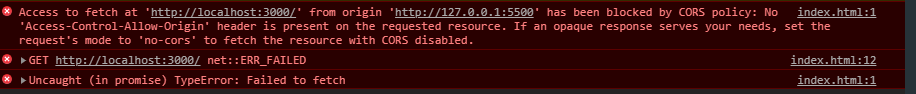

### CORS 해결방법

- 동일 출처 정책때문에 CORS같은 상황이 발생 하면 외부서버에 요청한 데이터를 브라우저에서 보안목적으로 차단

---
## 1. 상황발생

- Front

```jsx
<template>
<div class="hello">
    <h1>{{ message }}</h1>
    <button v-on:click="addData">업데이트</button>
</div>
</template>

<script>
export default {
data() {
    return {
    message: ""
    };
},
methods: {
    addData() {
    this.$http.get("http://localhost:3000/hello").then(res => {
        this.message = res;
    });
    }
}
};
</script>
```

---

- Back

```js
const express = require('express');
const app = express();


app.get('/hello', (req, res) => {
    console.log("come in")
    res.send('hello world')

});

​app.listen(3000, () => {
    console.log('Express App Listening on Port 3000')
})
```

---

## CORS 발생



---

## 해결방법

1.  http header에 Access-Control-Allow-Origin을 모두 허용(\*)

    ```js
    const express = require("express");
    const app = express();
    app.get("/hello", (req, res) => {
      res.header("Access-Control-Allow-Origin", "*");
      // * 대신 해당 IP/포트를 넣어도 된다
      console.log("come in");
      res.send("hello world");
    });
    app.listen(3000, () => {
      console.log("Express App Listening on Port 3000");
    });
    ```

    단, 이렇게 작성하면 모든 포트와 ip의 접근을 허용하므로 보안성을 강화할 필요가 있다.  
    그래서 http객체 header에 접근할수잇는 Setting을 더 해줘야한다.

    ```
    Access-Control-Allow-Origin : *
    Access-Control-Allow-Method : GET, POST, PUT. DELETE, OPTIONS (디폴트는 GET, POST)
    Access-Control-Max-age : 3600
    Access-Control-Allow-Headers : Origin, Accept, X-Requestd-With, Content-Type,Access-Contorol-Request-Method,
    Access-Contorol-Request-Header, Authorization
    Access-Contorol-Allow-Credentials
    - 클라이언트 요청이 쿠키를 통해서 자격 증명을 해야 하는 경우에 True를 응답받은 클라이언트는 실제 용청시 서버에서  정의도니 규격의 인증값이 담긴 쿠키를 같이 보내야한다.
    ```

---

2. `CORS` 모듈을 설치

   ```bash
   $ npm i cors
   ```

   ```js
   const express = require("express");
   const cors = require("cors");
   const app = express();

   app.use(cors());
   app.get("/hello", (req, res) => {
     console.log("come in");
     res.send("hello world");
   });
   app.listen(3000, () => {
     console.log("Express App Listening on Port 3000");
   });

   // 단 CORS로 사용하면 모든 접근을 허용하면 보안성의 문제가
   // 발생하니까 CORS의 함수안에 접근할수있는 주소랑 포트를 세팅하면
   // 보안성을 강화할수있다.
   const express = require("express");
   const cors = require("cors");
   const app = express();
   const corsOptions = {
     origin: "http://localhost:3000",
     credentials: true
   };
   app.use(cors());
   app.get("/hello", (req, res) => {
     console.log("come in");
     res.send("hello world");
   });
   app.listen(3000, () => {
     console.log("Express App Listening on Port 3000");
   });
   ```

---

3. Proxy를 만들어서 Cors해결(vue.confid.js)
   ```js
   module.exports = {
     devServer: {
       proxy: {
         "/": {
           target: "http://localhost:3000",
           changeOrigin: true
         }
       }
     }
   };
   ```

---
