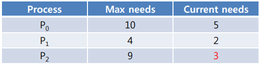

## 운영체제 6

## 1. 교착상태(Deadlocks)
- 프로세스는 실행을 위해 여러 자원(하드웨어)을 필요로 한다.
- 필요한 자원을 모두 다 갖지못하면 모든 자원을 충족할때까지 대기한다
- 이러한 상태에서 계속해서 다른자원을 가지려고 하는 상태가 지속대면 교착상태 발생 가능성이 높음
- 필요조건(`모든 조건이 충족되어야지 발생 가능성 있음`)
  - 상호배타 : 다른 프로세스와 자원을 공유 못함
  - 보유 및 대기 : 계속해서 자원을 충족할때까지 대기
  - 비선점 : 우선 순위에 따라 자원 탈취를 못함
  - 환형대기 : 자원할당도가 원형의 모습으로 

## 2. 교착상태 처리
1. 교착상태 방지
    - 교착상태 필요조건 4가지 중 하나라도 만족이 안되게!!
    - 상호배타 : 자원을 공유 가능하게 => 일반적으로 자원(CPU, Memory, Disk)을 공유하는것은 불가능에 가까움
    - `보유 및 대기`
        - 보유와 대기를 못하게 설정 : 식사하는 철학자에서 왼쪽 젓가락을 들고 오른쪽 젓가락이 사용못하면 왼쪽을 다시 두는방법
        - 단점 : 모든 철학자가 식사를 못하는 기아 발생 / 자원 활용률 저하
    - 비선점
        - 자원을 선점 가능하게 설정
            - 일반적으로 불가능 프린터를 사용하다가 갑자기 뺏어가면 다른 프린터가 나옴(불가)
            - CPU switching으로 가능하겠으나, 비 추천
    -`환형대기`
        - 자원을 번호 부여하여 오름차순으로 자원을 요청
    - 일반적으로 `보유 및 대기 방지법`과 `환형대기 방지법`을 사용
2. 교착상태 회피
    - 교착상태를 자원요청에 대한 잘못된 승인이라고 정의!!!
    - 활용 가능 자원 : 12개
    - 안전한 할당 : 초기에 적절하게 분배하여 계속해서 프로세스를 완료시키고 배분할수 있는 할당
    
    - 불안전한 할당 : 초기에 부적절하게 분배하여 계속해서 프로세스를 완료시키고 배분할수 없음
    
    - Banker's Algorithm을 활용하여 은행이 파산안되게 하는 방법이 교착상태 회피법이다!
3. 교착상태 검출 및 복구
    - 교착상태 방지 / 회피와는 다르게 교착상태를 일어나는 것을 허용한다.
    - os 안 프로세스 관리부서 안에서 지속적으로 교착상태 여부를 검사한다(지속적인 검사로 오버헤드 발생)
    - 교착 상태 발생 시 복구
        - 복구 방법 : 프로세스 일부 강제 종료, 자원을 선점하여 일부 프로세스에게 할당 
4. 교착상태 무시
    - 실제로는 잘 안 일어나기 때문에 따로 대비책을 조치하지 않는다

## 3. 정리

- 하드웨어 중 가장 중요한 자원 : CPU
- os안에서 CPU의 시간을 관리하는 곳 : CPU Scheduler
- OS안에서 CPU의 동기화를 관리하는 곳 : CPU synchronization => 세마포로 이용해서 동기화 정리, DEADLOCK 

---
## 자바 모니터(동기화)
- 자바에서 고수준 동기화 도구 ( = 세마포 : 저수준 동기화 도구 )
- 구조
    - 공유자원 + 공유자원 접근함수
    - 2개의 QUEUE : 베타동기 + 조건동기
    - 공유자원 접근함수에는 최대 1개의 쓰레드만 진입
    - 진입 쓰레드가 조건동기로 블록되면 새 쓰레드 진입가능
    - 새 쓰레드는 조건동기로 블록된 쓰레드를 깨울 수 있다.
    - 깨워진 쓰레드는 현재 쓰레드가 나가면 재 진입할수 있다.
    

- 자바의 모든 객체는 모니터가 될 수 있다.
    - 배타 동기 : 공통 변수에 한 쓰레드만 접근가능하게 한다. 함수 앞에 synchronized 키워드 사용
    - 조건 동기 : 접근 한 쓰레드를 wait을 통해 조건동기에 담아 주고 notify로 다시 꺼내어 쓰레드를 사용 (notifyAll는 전체다 꺼내기)
        ```java
        class C {
            private int value, …;
            synchronized void f() {
            ... }
            synchronized void g() {
            ... }
            void h() {
            ... }
        }
        ```
