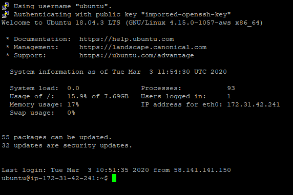

## AWS의 EC2로 Hello World를 찍어보자

## EC2
- AWS 제공하는 클라우드 서버 컴퓨터를 제공해주는거다(인스턴스 = 컴퓨터)
- 순서
    1. EC2의 인스턴스 생성 버튼을 클릭
    

    2. 인스턴스의 운영체제를 선택(무료로 선택)
    

    3. 인스턴스의 CPU 선택(무료로 선택)
    

    4. 인스턴스의 기본적인 설정(오토스케일, 서브넷 등등)을 default값 선택
    

    5. 인스턴스의 저장용량 선택
    

    6. 인스턴스의 태그 지정
    

    7. 인스턴스로 방화벽을 설정(ssl 설정, http 설정)
    

    8. 인스턴스의 키 다운(저장장소 : 가장 안전한 장소)
    

## Putty로 SSL 접근
- 순서
    1. host Name에 인스턴스 ip 입력 
    
    
    2. Connection - Data - Auto-login username : 'ubuntu'
    
    - username은 선택한 운영체제에 따라 다르다

    3.  Connection - SSH - Auth 다운받은 키를 넣어준다
    
     - 다운받은 키를 putty 전용으로 변경 필수

    4. Open을 통해 접속
    

    5. 아파치 설치 및 index.html 파일 입력
    ```sh
    sudo apt-get update             // 최신소프트웨어로 갱신
    sudo apt-get install apache2    // apatche 설치
    cd /var/www/html                // index 파일 위치
    sudo rm index.html              // index 파일 삭제(기존에 있던거)
    touch index.html
    vi index.html
        <html>                      // index 파일 입력
        <body>
            Hello World
        </body>
        </html>
    ```

    6. Public DNS에 값을 url 이동
    

## 후기 
- aws를 통해 쉽게 서버컴퓨터를 운용 할 수 있게 되었다.
- 제일 중요한 것 방화벽 설정!!! ssl과 http는 중요하다 다음 포스팅은 인바우드 아웃바운드에 대해서 작성해야겠다.
