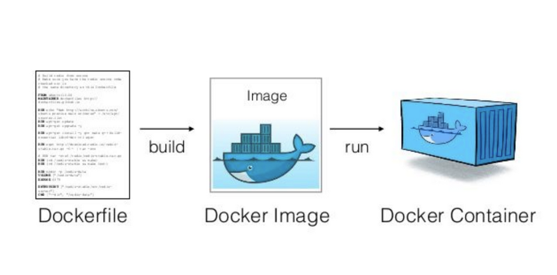

## AWS

## 1. docker

- VM 머신
    - hypervisor: 하드웨어를 추상화한것
    - 컴퓨터 위에 컴퓨터를 올리는 것
    - 무겁다
- Dcker Enging
    - 리눅스만!! 가능하다
    - 만약 Host OS가 리눅스 버전 A라면 컨테이너의 리눅스 B에서 필요한 부분만 패키징하여 실행을 시킨다   (전체 패키징 하는것이 아니다.)
    - 가볍다
    - 메모리 접근, 파일 시스템, 네트워크 속도가 좋다
    - 이유 : VM은 다시 하이퍼비저로 변환 시켜야해서 속도가 저하??
- dockerizing
    
    - `Dockerfile`을 작성한다.
    - 도커파일을 통해 이미지를 생성한다.
        ```docker
        FROM node:10
        // 노드 서버를 가져온다(local -> hub에서 로딩)
        // 기반이미지 == 노드를 기반으로 만든다.
        COPY . .xw
        /// 파일을 복사한다(필요에 따라 설정가능)
        RUN npm install
        // 이미지가 만들어질떄 실행되는 명령어
        // ADD 명령어는 build 명령 중간에 호스트의 파일 시스템으로부터 파일을 가져오는 것이다. 말 그대로 이미지에 파일을 더한다(ADD).

        CMD ["node","index.js"]
        // CMD vs ENTRYPOINT
        // CMD : 기본 명령어 하지만 다른 명령어 가능
        // ENTRYPOINY : 파라미터를 받아 지정해높은 명령어를 실행
        ENTRYPOINT ["/bin/bash", "-c", "echo Hello, $name"]
        npm run junho
        echo hello junho //가 나온다
        ```
 - docker 명령어
    - docker run 4000(host ip) : 3000(docker ip)
    - command T 도커 커맨드 창  
    - Docker exec -it 컨테이너 /bin/bash
    - it 옵션
        -i : interactive, -t ; tty
        이 옵션을 줘야 컨테이너 안에서 터미널 실행 가능
    - docker run -p -d 4444:3000 docker-example:0.1. << -d를 붙여주면 데몬으로 실행
    - docker는 imutable 속성을 가지고 있는다. 데이터를 변경하고 다시 docker의 데이터는 변경되지 않는다. 그래서 이러한 특성떄문에 volume을 사용한다.
    - docker /data 데이터 볼륭
 - docker는 디렉토리가 없다. foo/bar/a << 이 자체가 파일명

## 2. 아이피
 - IPv4 vs IPv6
    - ipv4 : 8비트씩 4부분으로 10진수로 표시
    - 주소할당 방식 : 첫번째 바이트 0 / 1 -> 두번쨰가 0 / 1 -> 세번쨰 0 / 1
        - A Class : 0 ~ 127
        - B Class : 128 ~ 191
        - C Class : 192 ~ 223
        - D Class : 224 ~ 239
        - E Class : 240 ~ 245
    - Private Ip address
        - Class A 10 .0 .0.0 == 10.255.255.255
        - Class B 172.16.0.0 ==  172.31.255.255
        - Class C 192.168.0.0 ==  192.168.255.255 
    - Public Ip Address
        - private IP를 제외하고는 전체다 public ip
        
    - ipv6 : 16비트씩 8부분으로 16진수로 표시
- CIDR(사이더)
    - CIDR(사이더) 기법이란, 기존의 IP 주소 할당방식인 Network Class 방식을 대체하기 위해 개발된 도메인간 라우팅 기법으로 최신 IP 할당 방법이다.
    - 서브넷마스크를 통해 ip를 더욱더 효과적이게 많이 할당받아서 가지고 있지말고, 필요한 만큼만
            ```js
            192. 168. 0. 15 / 24

            11000000.10101000.00000000.00000001

            Network Addr : 192.168.0.0 / 24
            Subnet Mask : 255.255.255.0
            Broadcast Addr : 192.168.0.255
            First Host : 192.168.0.1
            Number of Host : 254
            ```
    - 위의 주소 192.168.0.15/24 의 의미는 192.168.0.1 부터 192.168.0.255 까지의 주소 범위를 의미하는 CIDR 표기법이라 할 수 있다. (앞의 24 bit가 Masking 이기 때문이다.)
    - `192.168.0.15/32` 로 표기하면 이는 `192.168.0.15` 주소 그 자체를 의미한다.(32bit masking)

- subnet Mask
    - ip주소를 어디까지 네트워크 어디까지 호스트인지 알수 있다
    - 서브넷 마스크를 통해 private ip여부를 확인할수있다.
    - Default Subnet Mask
        - 네트워크를 서브넷으로 나누지 않고 기본으로 사용해도 서브넷 마스크는 있습니다.
            - 클래스C : 255.255.255.0  - 1111 1111.1111 1111.1111 1111.0000 0000 
            - 클래스B : 255.255.0.0    - 1111 1111.1111 1111.0000 0000.0000 0000
            - 클래스A : 255.0.0.0      - 1111 1111.0000 0000.0000 0000.0000 0000

 - http(80) / https(443) 기본포트

## 3. aws
 - IDC vs VPC
    - Internet Data Center(IDC) : 물리서버
    - Virtual Private Cloud(VPC) : 클라우드 환경 안에서 서버를 올려놓고 개인에게 서버 주는것 공인아이피로 
 - AWS default ip : B class
 - internet gateway : aws에서 사용하는 게이트웨이 => public ip 연결하여 외부와 통신하는것
 - ACL : Access Control List => 네트워크 방화벽 설정(inbound / outbound 설정)
 - SG : Security Group => 인스턴스 방확벽 설정(inbound / outbound 설정)
 
    - elb (elastic load balance) : 4 / 7 계층애서 구분
        - OSI 7계층에서 4계층인 transport 계층에서 port 를 통해 구분하는것(해당 포트인지 아닌지)
    - alb (aplication load balance) : 7 / 7 계층에서 구분
        - OSI 7계층에서 7계층인 application 계층에서 path 를 통해 구분하는 것(해당 url/path/page로 로드앤밸런스 진행)
 - target group
 - lass Pass Sass Cass Fass

 - ec2 : Amazon Elastic Compute Cloud (서버 컴퓨터)
 - s3 : aws file system
 
 
 - cloud front  : html, css, js 정적파일 제공
 - ecs
    - ec2 : ec2 상에서 서비스를 올리는 것
    - fargate : 컨테이너만 올리는 것 서버가 어디로 올리가는지 몰라도 되(프로비저닝)
 - rdb
 - subnet
    - private subnet : vpc 안에서 ip를 구분하는것
    - public subnet : vpc 안에서 공인 ip로 연결하고 싶은떄 사용
 - elastic cashing
 - route 53
    - DNS, 라우팅, 리소스 상태확인
 
