## 포스트맨 사용법
1. 정의
    - 백앤드 개발자와 협업하기 위해
    - REST API가 어떤 JSON을 내려주는가

2. 사용법
- collection 생성(프로젝트 폴더 명 생성)
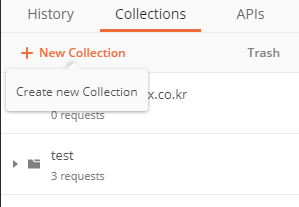
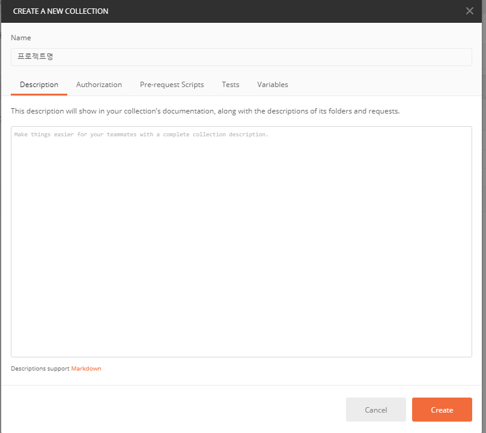

- REST 작성하여 SAVE 버튼 눌러 해당 collection에 저장
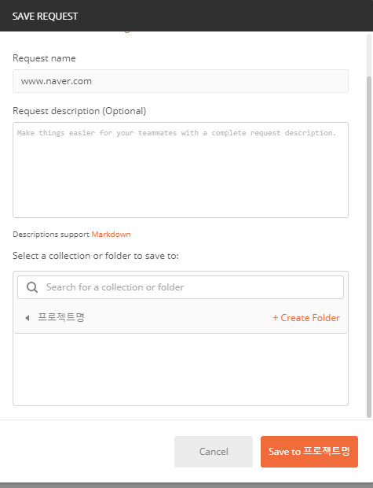

- 변수 사용법({{}} Vue.js 변수처럼 사용)
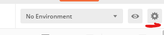
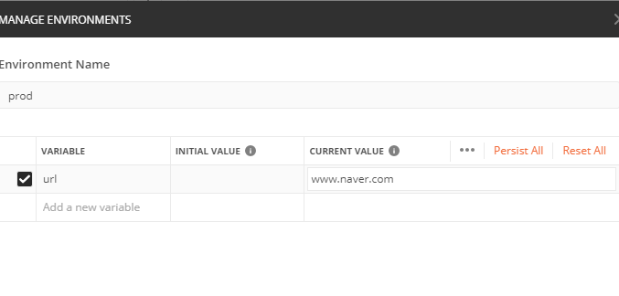
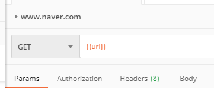
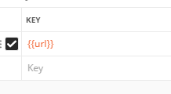

- 파일 전송시 옵션
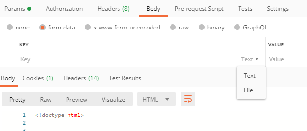

## 셀레니움 사용법
1. 정의
    - 화면 플로우를 저장하여 실행시켜준다.
    - 플오루는 사용자가 정의에 따라 수정 할 수 있다.
2. 사용법
- 셀레니움 아이콘 클릭
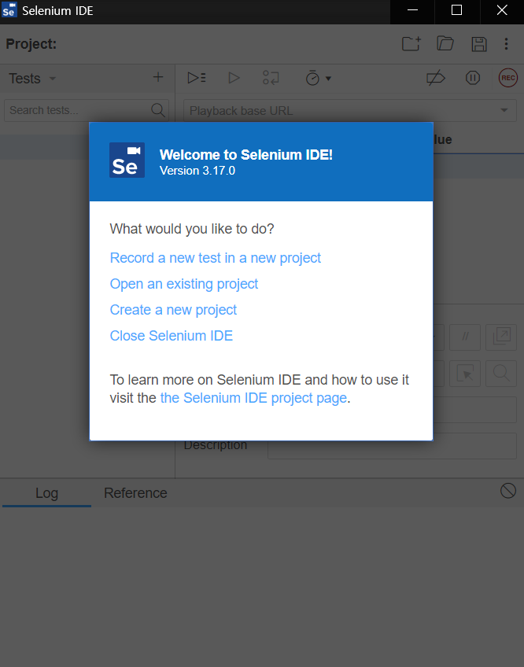

- 프로젝트 명 입력
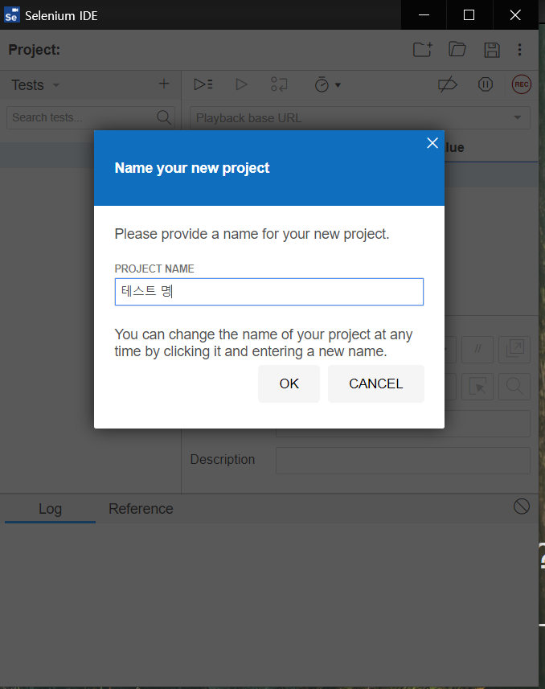

- 프로젝트 base url 입력
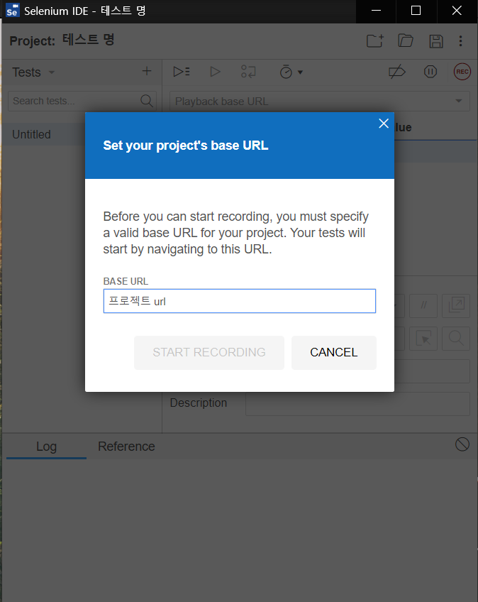

- 저장 후 해당 플로우 나옴 재생 버튼을 눌러 다시 실행
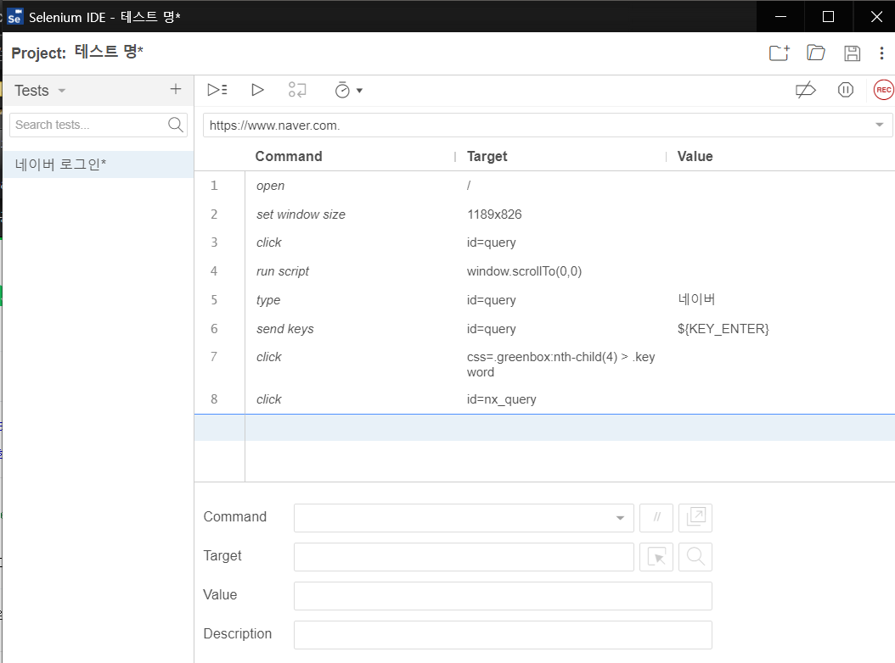
