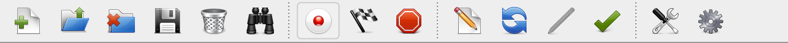
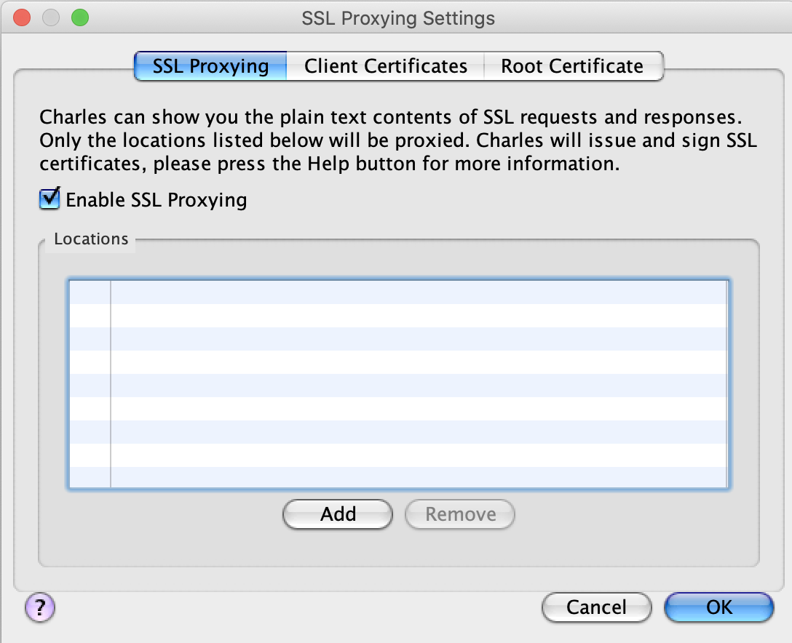
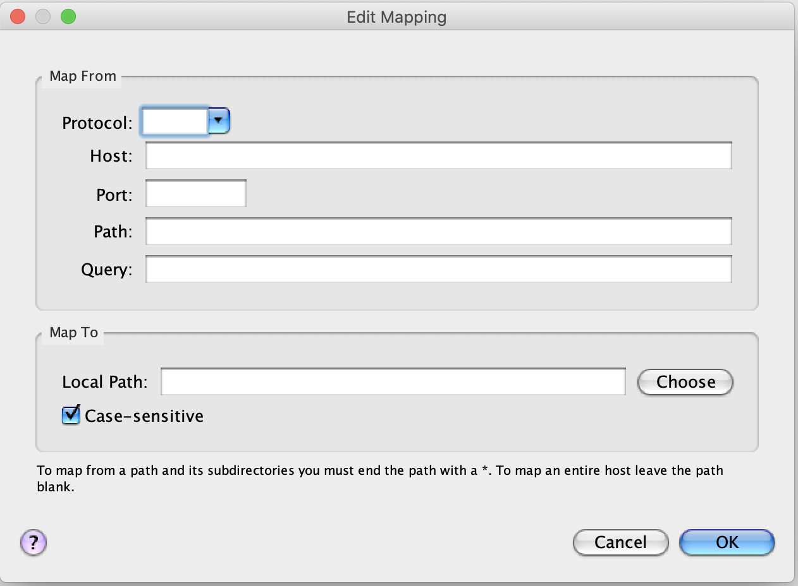
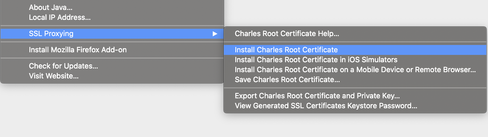

## Charles 사용법

1. Charles란?
- 로컬 컴퓨터에서 액세스하거나 로컬 컴퓨터를 통해 HTTP, HTTPS, HTTP / 2 및 활성화 된 TCP 포트 트래픽을 볼 수 있습니다.
- 프록시 툴로써, 운영중인 서비스의 네트워크로 들어오는 파일을 바꿔서 바로 테스트 할 수 있다. 개발서버로 올리기전 확인 / 로컬에서 확인
![charles 전체화면(../../assets/charles2.png) 
        
2. 화면설명

  - 세션 생성/열기/삭제/저장 - 세션을 기준으로 관리
  - 세션 비우기/찾기 - 현재 세션 비우기 / 찾기
  - 시작 / 조절 / 검사버튼
    - 시작버튼을 누르면 charles가 모든 네트워크 감시한다
    - 조절을 하면 네트워크 량을 조절

- SSL Proxying 세팅하는 곳이며, 테스트할 서비스를 등록한다.

- Map From : api 요청하는 곳
- Map To : api 요청을 가로쳐서 다른 파일을 보여줄것

- 해당 인증서를 등록 후 인증상태를 신뢰로 변경(유틸리티 -> 키 체인 -> 시스템 -> 찰스 인증서 클릭 후 수정)
