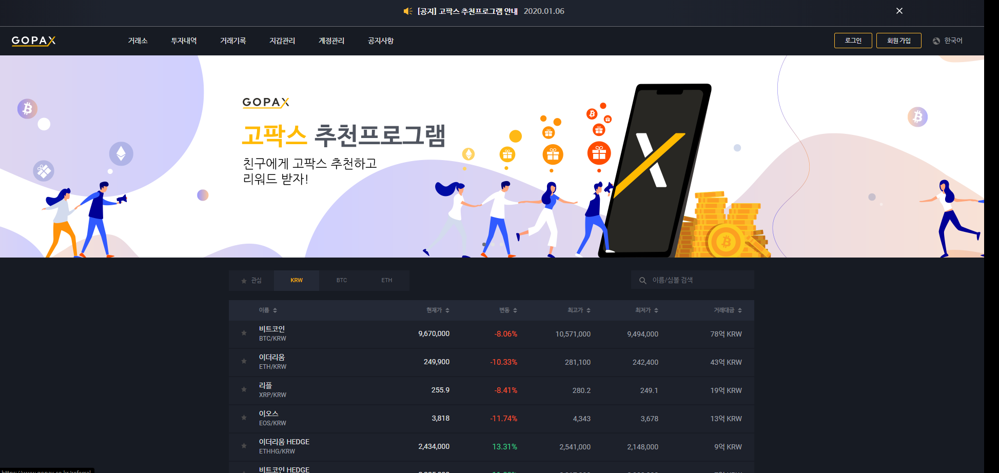
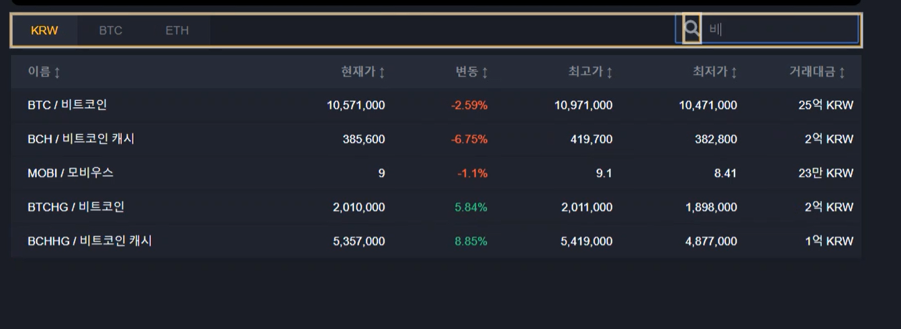

## 가상화폐 현황 게시판

1. 프로젝트 개요
    - public Api를 반복적으로 요청하여 데이터 변경 

2. 기능 분석
    - 단위화페를 기준으로 변동되는 데이터
    - 검색기능
    - 기준에 따른 금액 정렬 기능
    - 일정시간에 따라 변경되는 금액

3. 디자인 가이드
    - 기본적인 가상화폐 현황 게시판
    

4. 개발 및 후기
    - 검색기능을 구현하기 위해 원본 데이터를 변경시키지 않고 조건에 해당하지 않는 컴포넌트(row)를 렌더링 시키지 않아 검색 이후에도 같은 데이터를 유지 할 수 있었습니다.
    - shouldComponentMount에 setInterval을 통해 반복적으로 기초 state값을 변경 할 수있었다.
    
