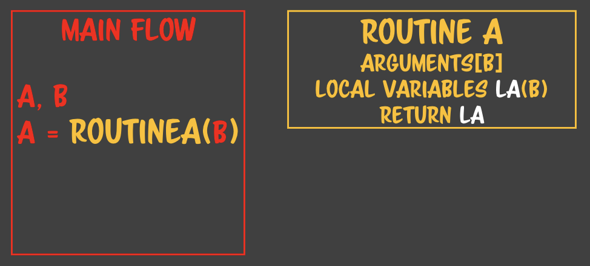
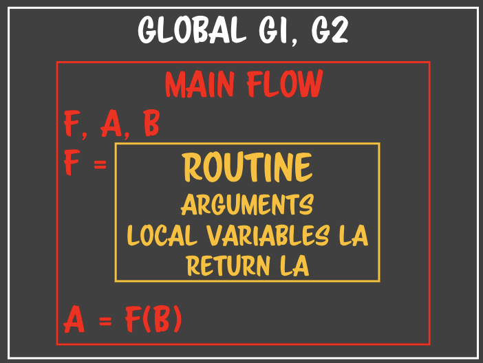
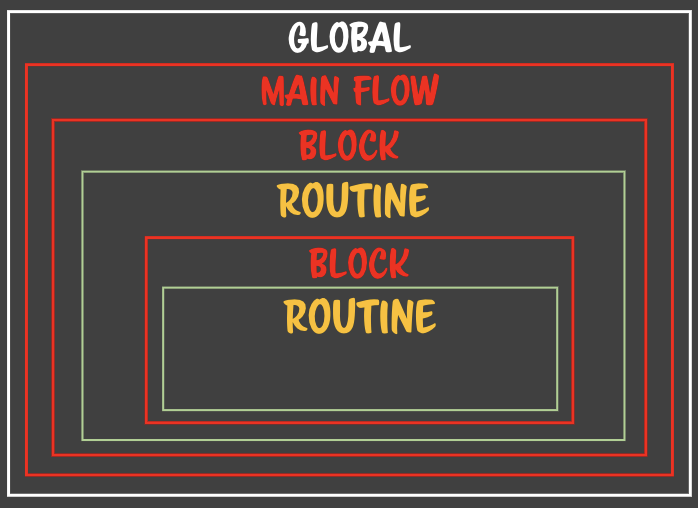

 ## SPREAD REF
 
 1. 메인루틴과 서브루틴이 값을 공유하는 방법
     - arguments : 메인루틴에서 서브루틴을 보낼때의 인자값
     - return : 서브루틴이 실행종료되고 메인루틴으로 보내는 리턴값
 2. 값을 공유할 때, type의 중요성
     - Primiteve : 값이 복사되며, 원래의 값에 영향을 끼치지 않는다(메모리에 새로운 값 생성)
     - Reference : 원래 값의 주소를 가르키는 포인터를 보낸다(기존에 가지고 있는 값을 이용)
 3. Reference type을 전달하게 된다면? 어떤 문제가 발생하나?
     - 상호/연쇄 참조 발생(이름은 다르지만, 값을 가르키고 있는 포인터가 변경되지 않기때문)
     - 커플링 발생!
     - 같은 포인터를 가진 변수를 함수를 통해 상태변화를 시키면 모두다 변경
     - 리펙토링시, 여러 루틴에서 값을 가지고 있기때문에 작동이 안될수 있다.
     - 디버깅시, 리펙토링과 동일하게 오류의 원인을 찾기 힘들다
 4. 해결책
     - 인자로 넘길때도 값을 복사해서 넘겨주고, 서브루틴안에서 값을 복사하여 사용한다!
     - 신경쓰고 싶지않다면, 모든 값을 복사해서 새로운 값을 만들어서 작업한다.
     - 메모리 걱정은 하지말자. 자바크립트는 Mark And Sweep으로 사용되지 않으면 삭제된다.
     - 목표는 각 루틴마다 가지고 있는 상태의 값이며, 상태변화에 따른 사이드 이펙트 적게 하자.
 
 ```jsx
 const foo = {};
 let bar = null;
 
 // foo는 bar를 서로 참조하여 상호참조라는 오염이 발생
 bar = hello(foo);
 
 // hello 함수의 인자로 참조타입
 function hello(arg){
 	// variable을 들어온 참조타입 인자로 할당
 	const variable = arg;
 	return variable
 }
 ```
 
 ## SUB ROUTINE CHAIN
 
 1. 루틴에서 루틴을 호출되는 순간 이전 루틴의 정보(Execution Context)를  Snap Shot을 통해 콜스택에 저장
     - Execution Contex :  함수호출시, Snap Shot(인자와 지역변수)에 대해서 메모리가 생성된다.
 2. Tail Resurtion 지원시, 루틴을 호출하는 라인이 return이면 실행환경 컨택스트를 저장 할 필요가 없다
     - 인자와 지역변수는 return문 이후로는 사용되지 않고, 단순히 전달만 해주기때문
     - 함수의 실행 컨택스트를 유지 할 필요가 없으므로 호출 이후 메모리에서 사라진다.
     - 함수의 리턴포인트는 언어 수준에서 결정되므로 브라우저마다 다름 (꼬리물기 최적화 조건을 지원시)
 
 ```jsx
 function r1(){r2()}
 function r2(){r3()}
 function r3(){}
 
 r1()
 ```
 
 ## TAIL RECURSION
 
 1. 현재 apple OS의 사파리만 지원
     - Tail Resursion 조건을 맞춰서 함수를 실행하면 됨(스펙 참조)
     - 실행시  Stack OverFlow에러는 안나지만, Time out 에러가 발생될수도 있음.
 2. 모든 연산자는 꼬리물기의 최적화를 방해한다
     - 모든 연산자는 연산시, 메모리를 생성한다(앞에 있는 것과 연산을 하기 위해서 메모리에 기억)
     - 단! 삼항연산자, 논리연산자(&&, ||)는 지연평가를 하기때문에 꼬리물기 최적화시 메모리를 안한다.
 3. 연산자로 인한 문제 해결책
     - 연산을 인자로 옮긴다.(연산의 결과값을 이전의 함수가 가지고 있는게 아니라, 연산을 하고 인자로 넘김)
     - 콜에서 연산을 실행하고 해제(인자로 넘겼으니까, 기억할 필요 없다), 다음 루틴의 값으로(인자) 전달
     - 현재 함수의 메모리는 제거하고 호출하는 함수 메모리(메모리)를 사용한다.
 4. Tail Recursion은 결국 반복문이다(TAIL RECURSION TO LOOP)
     - 제어문의 스택 클리어 기능을 활용하여 메모리를 제거해주고 다음 연산을 실행하는 것이다.
     - 컴퓨터에서 꼬리물기최적화는 루프문으로 바꾸는것이다.(결국 파싱하면????)
 5. 제어문의 스택 클리어 기능
     - 제어문은 연속된 호출에 대해서 제어문을 통해서 스택을 클리어(스펙)
     - 제어문에서 while, for 문을 써야지 루프에 대한 스택을 클리어 할 수 잇다.
     - 해당 인덱스를 실행하고 메모리에서 해당 스택을 비우고 인덱스만 가지고 다음 스택 생성
 
 ```jsx
 //연산자 + 로 인해 전에 값을 저장해야 하기때문에 지원불가
 const sum = v => v + (v > 1 ? sum(v - 1) : 0);
 sum(3);
 // sum 3 return 3 + sum(2)
 // sum 2 return 2 + sum(1)
 // sum 1 return 1 + 1
 
 //연산자를 바디안에서 결과를 앞치고 인자로 넘긴다.
 const sum = (v, prev = 0) => {
 	prev += v;
 	return (v > 1 ? sum(v - 1, prev) : prev);
 };
 sum(3);
 // sum3 return sum(2, 3);
 // sum2 return sum(1, 5);
 // sum1 return 6
 
 //Tail Recursion To Loop
 const sum = v => {
 	let prev = 0;
 	while(v > 1){
 		prev += v;
 		v--;
 	}
 	return prev;
 }
 ```
 
 ## CLOSURE
 
 1. STATIC STATE
     - `루틴 === 문`
         - 함수를 선언하는것은 문이지 자바스크립트처럼 변수에 대입할 수 있는  값이 아니다.
     - 함수를 문으로 만드는 언어의 특징
         - 메인 플로우 밖에서 루틴이 생성
         - 전역 메모리의 변수와 생성된 루틴 내의 지역변수만을 사용
         - 정적 디스페치를 통해 컴파일시, 서브루틴의 메모리(주소와 크기)를 확정
         - 루틴과 서브루틴의 관계가 별도있기 때문에 클로져가 생기지 않음.
 
     
 
 2. RUNTIME STATE 
     - '루틴 === 값`
         - 런타임 중에 루틴을 생성시킬 수 있다.(값 ⇒ 루틴)
     - 함수를 값으로 만드는 언어의 특징
         - 메인 플로우 안에서 루틴이 생성
         - 메인 플로우 내에서 생성되기 때문에 플로우 내의 변수도 접근 가능
         - 런타임 중이므로 언제 생겨날지, 얼마나의 크기를 가질지 모른다.(루틴 호출전까지)
         - 메인플로우 안!!에서 값의 형태로 있다가 갑자기 서브루틴이 생기면서 생겨난다(실행중간에)
         - 루틴이 처음부터 정적인 문으로 존재하지 않고 값의 형태로 존재한다
     - 자유 변수
         - 루틴 밖에 있는 변수 중에 해당 루틴이 인식할 수 있는 변수들을 Free variables라고 부른다.
         - 자유변수를 한번이라도 참조를 하게 되면 해제되거나 조작될 수 없다.(해당 루틴이 종료전)
     - 클로져
         - 클로저는 런타임 중에 루틴(루틴을 문이 아니라 값)을 만들 수 있는 언어에서 생겨난다
         - 자유변수는 루틴의 플로우가 종료가 되면 사라져야 하는데 서브루틴이 잡고 있으면 해제가 안된다.
         - 자유변수가 해제되지 못하고 갇혀있는 공간 `==` 서브루틴에 갇혀있으면 클로져라고 한다.
         - 단, 해당 서브루틴이 다른곳에서 노출되거나, 넘어가서 사라지지 않는다는 조건
 
 
 
 ## NESTED CLOSURE
 
 1. 스코프로 인해 생기는 클로져 ⇒ 스코프란 클로져를 만드는 행위
     - 클로저는 루틴만이 만드는게 아니다.(루틴도 또 다른 하나의 스코프)
     - es6이후에는 블록스코프가 생기면서 블록만 만들어도 스코프가 생긴다.
 
 ```jsx
 window.a = 3;
 if(a === 3) {
 	const b = 5;
 	const f1 = v => {
 		const c = 7;
 		if(a + b > c) {
 			return p => v + p + a + b;
 		} else {
 			return p => v + p + a + b;
 		}
 	};
 }
 ```
 
 
 
 ## SHADOWING
 
 1. 새도잉이란?
     - 중첩된 클로져가 있는데 각각의 클로져의 상태에서 같은 이름의 변수를 소유했을때 일어난다.
     - 이름이 겹치면, 현재 코드가 실행할때 가장 가까운 클로져의 영역을 사용한다.
     - 가장 가까운 변수만 사용되고 밖에 있는 변수는 그림자가 가리듯 가려진다.
 2. 왜? 사용하나?
     - 네임스페이스를 정의할떄, 변수가 내부와 외부가 다른 의미로 사용되어야 할때
     - 클로져 안에서는 자유변수를 오염시킬 위험이 굉장히 높다(오염 방지)
     - 자유변수의 오염을 막을 수 있는 유일한 방법
     - 좋은 변수명은 자바스크립트 코어(Date, Array)가 선점을 했기때문에 위험하므로 쉐도잉하자
 
 ```jsx
 const a = 3;
 if(a == 3) {
 	const a = 5;
 	const f1 = v => {
 		const a = 7; // a를 쉐도잉해서 오염을 막았다!
 		console.log(a);
 }
 ```
 
 ## CO ROUTINE
 
 1. 커맨드 패턴
     - 명령어를 직접 실행하지 않고, 명령어 하나하나를 객체나 함수에 담는다.
     - 실행하고 싶을때 해당 함수나 객체를 호출한다.
     - 문을 중간에 멈출 수 있다(함수를 호출한다 ⇒ 서브루틴을 만든다)
 2. 자바스크립트 내의 실행기
     - 자바스크립트는 es6부터 하나의 문을 레코드라는 객체로 감싸 메모리에 저장
     - 명령어가 한번에 실행하는게 아니라, 레코드 하나하나씩 invoke(실행기)를 통해 실행
     - 커맨드 패턴과 비슷하다. 코루틴을 할 수 있다( == 문을 중지 시킬 수 있다)
 3. Single Routine
     - 루틴에서 서브루틴을 호출하면 플로우를 진행해서 끝맞추고 리턴하는것
     - 싱글루틴은 루틴의 플로우가  끝까지 실행한다는 것을 보장한다.
 4. Co Routine
     - 코루틴에서는 플로우를 끝까지 진행안하고 정지시킬 수 있다(Suspension/일시정지)
     - 서브루틴에서 yield를 통해서 서스펜션이 일어나면 리턴포인트로 제어권이 이동한다.
         - 언어마다 yield라는 네임은 다를 수 있다.
     - 코루틴에서 서스펜션을 통해 정지된 서브루틴을 여러번 호출할 수 있다.
 5. Co routine의 장점
     - 함수가 아니라 문에도 서스펜션을 걸 수 있다.
     - 서브루틴내에서 어떠한 값을 공유해야 한다면 서스펜션을 통해 지역변수 상태를 유지할수있다.
     - 서스펜션이 걸려있는 코루틴은 메모리를 해지하지 않는다. 플루우가 끝나지 않았기 때문이다.
     - 결국, 루틴을 다시 호출하거나, 인자를 통해서 상태를 넘기지 않고 코루틴으로 간단하게 만들 수 있다.
     - 더 좋은, 더 읽기 좋은 코드를 만들 수 있다.
 6. 제네레이터를 통해 코루틴 구현
     - 제네레이터를 호출한 결과값을 코루틴이라고 한다.
     - 코루틴에서 루프 또한 정지 시킬 수 있다.
     - yield를 통해서 서브루틴을 호출한 리턴포인터로 돌아간다
     - 호출한 결과값은 value, done의 키를 가진 이터레이터 객체이다.
     - next()를 통해서 제네레이터를 호출하여 코루틴을 받을 수 있다.
 
 ```jsx
 const generator = function*(a){
 	a++;
 	yield a;
 	a++;
 	yield a;
 	a++;
 	yield a;
 };
 
 const coroutine = generator(3);
 
 let result = 0;
 result += coroutine.next().value;
 console.log(result) //4
 result += coroutine.next().value;
 console.log(result) //9
 result += coroutine.next().value;
 console.log(result) //15
 ```
 
 ### 수업 중 메모
 
 - 인자와 리턴으로 메인루틴과 서브루틴이 값을 공유
 - 참조값으로 공유를 하게 되면 많은 문제가 생긴다
 - 서브루틴에서 서브루틴이 호출된다(체이닝 ⇒ 꼬리물기 최적화(재귀함수))
 - 람다 : 루틴을 값으로 인식하고 처리하겠다.
 - 루틴안에 문을 값처럼 만들어서 처리하는 기술 C언어의 함수 포인터라는 기술의 발전
 - 루틴이 태어나는 환경을 컨택스트라고 한다.
 - 서브루틴을 값의 형태로 만드는 언어와 객체의 형태로 만드는 언어가 있다.
 - 자바의 메소드는 문이다 클래스 안에서 메소드를 정의해야 한다.
 - 런타임안에서 루틴이 생성되면 어떤 환경에서 생성됬는지도 기록한다. (This is Scope)
 - 생성된 루틴이 알 수 있는 변수가 전역과 지역변수 뿐만 아니라 내가 태어난 플로우의 변수도 알 수 있다.
 - 재귀와 꼬리잡기는 루프문으로 기계적으로 고칠수 잇다 그러면 이건 루프문이니까 꼬리 잡기로 고칠수있다.
