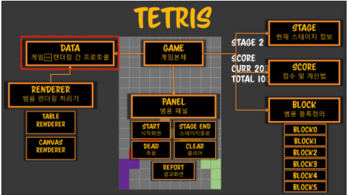

## 프로그램

### 1. 대화형(일반적인 프로그래밍)

- `이벤트`(Dom 이벤트, HTTP 이벤트)의 결과에 따라 작업을 정의
- 흐름을 제어하는게 아니라 전체적인 흐름에 맞춰서 어떻게 반응할지 프로그래밍
- 로직이 단편화되서 일관성이 요구되는 부분이 있다(데이터)
- 여기 클릭, 저기 클릭해도 데이터는 일관성 있게 관리 되어야 한다(예) 리덕스)
- 이벤트/다이어로그 프로그래밍(반응형 프로그래밍과 비슷)

### 2. 실시간(게임, 테트리스)

- `시간`이라는 플로우에 따라서 작업을 정의
    - 실시간 항공 충돌 시스템, 자율주행??
    - 1초 8번 클릭을 지속적으로 하는 것
- 플로우를 제어아하는게 아니라 계속해서 흐르는 시간 안에서 일어나는 일을 지속적으로 처리하는 프로그래밍

### 3. 이번 강의 목표

- 난감한 도메인을 만났을때 어떻게 데이터분석을 해서 처리할 수 있을까?
- 이러한 데이터분석이 객체지향이 될 수 있게 하자

---

## Before Makaing Tetris

> 모델링을 축소하면 안된다.

## 객체지향은 추상화라는 영역에 속해 있다.

1. Categorization
    - 일정한 기준으로 분류한다 ⇒ 디테일은 숨겨지고 카테고리만 나온다.
    - 예) 초급/중급/고급 개발자, 초/중/고/대 학생(여자/남자 구분이 없다)
    - 병렬 : 서로 연관이 없다.
    - 종렬(종속적인) : 속성이 세분화된다.(대한민국 서울시 강남구 ...)
2. Modeling
    - 현실세계에서 기억해야 할 것만 모아놓은게 모델링
    - 건담은 진짜 건담? ⇒ 내가 기억해야 할 디데일만 프로모델로 구현
    - 이!! 도메인에서 꼭 기억해야 할게 무엇이냐?(방법은 데이터 분석)
3. Groupinng / Set
    - 그냥 모은것, 무작위적인 집합(너너너너너너 1조, 너너너너 2조)
4. 결론
    - 추상화 기법은 적극적으로 활용하는것이 객체지향
    - 추상화를 이해하고 추상화 기법을 사용하여 모델링을 한다.

## 객체지향  프로그래밍 / 시스템 기준

### 1. 대체가능성(substitute)

- 보다 구성형은 추상형으로 대체될 수 있다
- 나를 보다 큰 카테코리 큰 모델링으로 변형해도 내가 그 자리에 들어 갈 수 있다
    - 개발자 ⇒ 한국사람 ⇒ 아시아인 ⇒ 지구인
- 자식 클래스는 부모 클래스를 대체 가능
    - 자식 클래스는 부모 클래스를 상속받았기 때문에 모든 속성을 다 가졌기 때문
    - 상속이나 위임을 가능하게 하는 이유는 대체가능성
- 구상클래스는 추상클래스 /  인터페이스를 대신 할 수 있다.
- 자바스크립트 상속은 프로토타입 체인으로 구현
    - 프로토 타입에 체인을 걸어서 그 다음 체인을 만든다.
    - instanceof 를 하면 chain 되 있는 모든 애들이  걸려서 나온다.

        ```jsx
        var a = [];
        a instanceof Array; // true
        a instanceof Object; // true
        ```

- 자바스크립트는 메모리가 부족하여 재활용하기 위해 체이닝을  사용하여 대체 가능성을 구현했다.

### 2. 내적동질성/내적일관성

- 구상 객체(인스턴스)는 원형(클래스)를 따른다(`표준`)
    1. 자식클래스에서 부모클래스의 메소드를  오버라이드 한 클래스
    2. 대체가능성으로 부모타입의 자식 인스턴스를 생성하고 오버라이드한 메소드를 호출하면
    3. 인스턴스의 원형 ⇒ 자식클래스의 함수가 호출된다.
- 원형에 따라서 오버라이드 있거나 오버라이드 있는 속성을 반드시 만들어진 구상 객체를 사용
- 자바스크립트도 부모의 메소드를 자식에 정의하면 자식 메소드가 사용(내적일관성 구현)

## 객체지향 프로그래밍의 최소한의 룰/매너

객체를 여러개 만들때 객체까리 서로 지켜야 될 매너가 있습니다.

### 1. 은닉

- 말 그대로 숨기는것
- 최고는! 아무것도 안보여주는것(요청은 했지만, 이것이 안/밖에서 줬는지 모르게)
- 언어 차원에서 강제로 뜯어보는것을 막을수있어야 한다(but, 옵션일뿐)
- 자바스크립트는 암묵적으로 `_`를 붙여서 은닉된 함수라고 생각한다.

### 2. 캡슐화

- 몰라도 되게, 바보를 만들기 위해, 내가 무엇을 하는지 모르게 은닉과 상관이 없다.
- 가장 모르는 수준까지(엄마 : '어디가니?' , 아들 : '놀러가요') 놀라가서 멀하는지 캡슐화한다.
- 가장 좋은 예는 ATM ⇒  내부작업에 대해서 알려줄 필요없다.
    1. 카드를 넣는다
    2. 비밀번호 입력
    3. 내부 작업 (터널링 ⇒ 인증서 ⇒ 화면) :  캡슐화
    4. 돈 인출

### 3. 참고

- [Hollywood Principle](https://en.wiktionary.org/wiki/Hollywood_principle)
- [SOLID](https://en.wiktionary.org/wiki/SOLID)
- [DRY](https://en.wiktionary.org/wiki/DRY)

## 테트리스 OOAD

### 1. OOAD ?

- 소프트웨어를 개발하는 하나의 방법론
- 모든 소프트웨어 시스템의 주요 기본요소를 구성하는 객체지향적인 분석과 설계 방법
    - 사물을 가르키는 객체
    - 그 객체들을 하나의 집합으로 묶은 클래스로
- 객체지향적이란것은 현실세계에서 실재하는 사물, 즉 객체들을 지향한다는 것
- OOA : 분석
- OOD : 설계
- OOP : 프로그래밍

### 2. 객체지향 분석 및 설계에 대한 추상화

- 현실
    1. 현 상황에 대해서 배우를 찾아내고
    2. 각 배우들의 책임과 역할을 정의하고
    3. 배우들간의 관계를 지정하고
    4. 각 배우들에 대한 대본을 쓴다
- 추상화
    1. 식별하고
    2. 일반화하고(object, class)
    3. 대상들 간의 관계 (inheritance, embedded)를 설정하고,
    4. 상호작용 하도록(behavior)한다.
- 도메인 ⇒ 도메인 개념의 시각화 ⇒ 설계 객체를 구현
    1. use case 정의 ⇒ 요구 분석
    2. 도메인 모델 정의

        1) 문제영역 분석 및 표현

        2) 객체지향분석은 영역객체를 분류하는 관점에서 관심영역을 기술하는것

       3)`도메인은 해결하고자 하는 대상 영역` ⇒ `소프트웨어는 도메인의 문제를 해결하기 위한 수단`

        4) 추상화

    3. 인터렉션 다이어그램 정의
    4. 설계 클래스 정의
    5. 난감한 도메인을 만났을때 우리는 어떻게 데이터 분석을 해서 처리할 수 있는가

       ⇒ 데이터 분석의 결과가 **객체지향이 될 수 있게 하는 것이 우리의 목표**

### 3. OOA

- 화면을 보고 객체를 분석(뷰 아래 로직이 깔려있다)
- 사물을 분석할때 추상화를 한다.
- 카테고리제이션 / 그룹핑을 할 수 있나?   판단!



### 4. OOD

### 1) 설계 유의사항

- 심플렉스티
    - 단일 방향 의존성
    - 의존성 방향이 한쪽으로 있는것
    - 심플렉스티를 유지하는게 좋다
- 멀티플렉스티
    - 의존성 방향이 양쪽으로 있는것(전파된다)
    - 멀티플렉스 상황이다? 우회하는 방법을 찾자
    - 데이터베이스에서 다대다 참조하면 양방향 의존성을 없애기 위해 브릿지 데이블을 만들어 일대다로 만든다
- 이러한 유의사항을 지키면 설계할수 있는 방법 : `그림으로 그려보자`
    - 멀티플렉스티를 최소한으로 방지하기 위해 그림을 그리고 객체지향의 의존성의 방향

### 2) 역할과 책임

- 역할을 언제나 동시에 권한과 책임이 온다(동전의 양면)
- " 누가 이 결정을 하지" ⇒ "누가 책임지지" (현실은 그렇지 않지만, 개발만...)
- 본인만의 고유한 영역이 있고, 본인이 책임져야할 한계가 있다 ⇒ 역할의 정의
- 역할인식(중급개발자로써의 관문)의 힘
    - 역할을 나눌때, 권한과 책임이 일치할 수 있도록 해야 한다

### 3) 역할로 나누어보자

### - GAME

- 형태 : 데이터
- 역할
    - 타이머를 돌려 매 블럭을 내려오게 한다
    - 블럭 생성/이동/삭제

### - STAGE

- 형태 : 데이터
- 역할 : 현재 스테이지 정보

### - SCORE

- 형태 : 데이터
- 역할 : 점수 및 계산법

### - BLOCK

- 형태 : 데이터 ⇒ 블럭별 카테고라이징
- 역할 : 범용 블록정의

### - PANEL

- 형태 : 데이터 ⇒ 패널별 카테고라이징
- 역할 : 시작화면, 스테이지 종료, 죽음, 클리어, 결과화면

### - DATA

- 형태 : 데이터
- 역할 : 게임 ↔ 렌더링 간 프로토콜
- 프로토콜로 중간에 중계해주는 이유?
    1. 상호간의 약속한 형태를 끼어 넣으면 상호간의 의존성이 줄게된다
    2. 범용 렌더링 처리기는 프로토콜의 데이터만 처리, 게임본체는 프로토콜의 데이터 형식으로 변환하여
    3. 한쪽이 변경되더라도 프로토콜의 형식만 맞추게 된다면, 다른 한쪽은 변경하지 않아도 된다.
    4. 매개체가 바뀌지 않는 이상, 한쪽이 변경되면 매개체의 형태로 변경해주면 된다.
- 언제 이런 프로토콜을 적용을 할까?
    1. 한쪽이 변화율이 높으면 프로토콜로 만들어준다(지속적인 업데이트로 인한 구조 및 데이터 변경)
    2. 변화율이 낮으면 그냥 바로 의존한다.

### - RENDERER

- 형태 : 데이터를 통한 화면 구현
- 역할 : TABLE RENDER, CANVAS RENDER

### 5. OOP

- 역할이 명확하고, 의존성 관계가 적은것부터!!
- 생성자 인자 listener를 넣어주는 이유는 의존성을 줄이고 통보만 해주기 위해

```jsx
- UTIL FUNC
const prop = (target, v) => Object.assign(target, v);
```

### - STAGE

- 스테이지가 끝까지 왔냐, 안왔냐 판단
- 스테이지가 끝이 아니라면, 한판 올라가면서 스피드를 올려주는것
- 없어진 line을 받아 해당 스코어로 점수 계산

```jsx
const Stage = class{
	constructor(last, min, max, listener){
		prop(this, {last, min, max, listener});
	}
	clear(){
		this.curr = 0;
		this.next();
	}
	next(){
		if(this.curr++ < Stage.last){
			const rate = (this.curr - 1) / (this.last - 1);
			this.speed = this.min + (this.max - this.min) * (1 - rate);
			this.listener();
	}
	score(line){
		return parseInt((this.curr * 5) * (2 ** line));
	}
}
```

### - SCORE

- 점수를 초기화
- STAGE를 통해 계산된 점수를 인스턴스의 상태값에 저장

```jsx
const Score = class{
	constructor(stage, listener){
		prop(this, {stage, listener});
	}
	clear(){
		this.curr = this.total = 0;
	}
// 수정후
	add(line){
		const score = this.stage.score(line);
		this.curr += score;
		this.total += score;
		this.listener();
	}

// 수정전
// add(line, stage){
// const score = stage.score(line);
// 수정사유
// - 지금이렇게 하면 add할때마다 새로운 스테이지가 공급된다(맞지 않다)
// - 도메인과 객체지향 관점에서 SCORE와 STAGE는 게임이 시작되면 하나씩만 생성
// - 굳이 계산할때마다, 임시바인딩해서(약결합) 불러올 필요가 없다(나쁜 코드??)
// - 작동은 정상작동하나, 의미가 맞지 않는다. 이러한 의사결정을 지속적으로 해야한다. 
}
```

### - BLOCK

- 여러가지 블록을 형태를 제공하니까 객체를 제공하는게 아니라 클래스를 제공
- 카테코라이징을 하기 위해 공통적인 부분을 찾아 정의한다(rotate부분)
- 자바스크립트는 함수 == 값, 클래스또한 값이다.

```jsx
const Block = class{
	constructor(color){
		prop(this, {color, rotate : 0});
	}
	left(){
		if(--this.rotate < 0) this.rotate = 3;
	}
	right(){
		if(++this.rotate > 3) this.rotate = 0;
	}
  getBlock(){
		throw 'override!';
	}
}

const block = [
	class extends Block{
		constructor(){
			super('#f8cbad');
		}
		getBlock(){
			return this.rotate % 2 ? 
				[[1], [1], [1], [1]] : 
				[[1,1,1,1]]
		}
	},
	class extends Block{
		constructor(){
			super('#ffe699');
		}
		getBlock(){
			switch(this.rotate){
		  case 0: return [[0,1,0],[1,1,1]];
		  case 1: return [[1,0],[1,1],[1,0]];
		  case 2: return [[1,1,1],[0,1,0]];
		  case 3: return [[0,1],[1,1],[0,1]];
			}
		}
	}
]
```

## 과연 추상화를 확실히 했을까?

1. 부모 클래스가 rotate를 관리하는데 자식 클래스가 부모의 rotate를 가지거나, 연산을 하는 것은 `은닉을 깨는것`
2. 부모와 자식간의 관계에서도 은닉과 캡슐화는 똑같이 성립해야 한다
3. 도메인 수준의 차이점은 색깔/모양 , 공통점은 이동/회전
4. 목표를 코드로 맞춰야지, 코드가 목표를 맞춰서는 안된다.
5. getBlock을 자식에서 부모로 옮긴다(rotate는 부모가 관리하니까)
6. getBlock을 호출할때마다 블럭배열을 계속해서 만들었는데 context 데이터로 만들어 메모리를 절약한다.

```jsx
const Block = class{
	constructor(color, ...blocks){
		prop(this, {color, rotate : 0, blocks, count:blocks,length - 1});
	}
	left(){
		if(--this.rotate < 0) this.rotate = count;
	}
	right(){
		if(++this.rotate > count) this.rotate = 0;
	}
  getBlock(){
		throw this.blocks[this.rotate]
	}
}

const block = [
	class extends Block{
		constructor(){
			super('#f8cbad', [[1], [1], [1], [1]], 
				[[1,1,1,1]]);
		}
	},
	class extends Block{
		constructor(){
			super('#ffe699', [[0,1,0],[1,1,1]], [[1,0],[1,1],[1,0]], [[1,1,1],[0,1,0]],[[0,1],[1,1],[0,1]]);
		}
	}
]
```

## - DATA

- 관심사항 : 데이터뿐!! 게임본체는 상관이 없다.

```jsx
const Data = class extends Array {
	constructor(col, row){
		prop(this, {col, row});
	}
}
```

## - RENDERER

- 관심사항 : 데이터뿐!! 게임본체는 상관이 없다.
- clear()는 자식들의 렌더링 하는 방식이 다르기때문에 (다형성을 위해)
- 템플릿메소드
    - 함수는 부모것이 호출이 되지만,  특정한 부분은 자식 클래스의 함수가 호출
    - 부모쪽에 있는 메서드가 많은 서비스를 제공하고 실제 할 일을 자식클래스에게 위임하기 위해 사용된다.

```jsx
const Renderer = class {
	constructor(col, row){
		prop(this, {col, row, blocks:[]});
		while(row--) this.blocks.push([]);
	}
  clear(){
		throw 'override';
	}
	render(data){
	  if(!(data instanceof Data)) throw 'invalide data';
		this._render(data); // 내적동질성에 의해서 자식인스턴스의 함수 호출
	}
	_render(data){throw 'override!';}
}
```

## - TABLE RENDERER

- 관심사항 : 색갈로 분류된 2차원 배열
- 블록이 변화가 있어날때마다 데이터로 렌더러는 호출하면 그려준다.
- 모델이 들어오면 모델대로 그림을 그려 모델렌더라고 부른다
    - 데이터가 바뀌면 새롭게 그린다(이전 상태를 저장하지 않는다)
- 적층형 렌더는 사용자의 인터렉션에 따라서 데이터가 쌓이고 난 다음 그린다
    - 데이터가 바뀌면 이전 상태를 참고해서 그린다.
    - 오류가 쉽게 일어난다.

```jsx
- UTIL FUNC
const el = (el) => document.createElement(el);
const back = (s, v) => s.backgroudColor = v;
```

```jsx
const TableRenderer = class extends Renderer{
	constructor(base, back, col, row){
		super(col, row);
		this.back = back;  // 초기 빈칸 색상(검정색)
		while(row--){
			const tr = base.appendChild(el('tr')), curr = [];
			this.blocks.push(curr);
			let i = col;
			while(i--){
				curr.push(tr.appendChild('td').style);
				// 스타일 객체를 넣는다.
			}
			this.clear();
		}
		clear(){
			this.blocks.forEach(
				curr => curr.forEach(s => back(s, this.back));
			)
		}
		_render(v){
			this.blocks.forEach(
				(curr, row) => curr.forEach((s, col) => back(s, v[row][col]))
			)
		}
	}
}
```

## - Canvas Renderer

```jsx
const CanvasRenderer = class extends Renderer{
  constructor(base, back, col, row){
    suepr(col, row);
    prop(this, {
      width: base.width = parseInt(base.style.width),
      height: base.height = parseInt(base.style.height),
      cellSize: [base.width/col, base.height/row],
      ctx: base.getContext('2d')
    });
  }
  _render(v){
    const {ctx, cellSize:[w, h]} = this;
    ctx.clearRect(0, 0, this.width, this.height);
    let i = this.row;
    while(i--){
      let j = this.col;
      while(j--){
        ctx.fillStyle = v[i][j];
        ctx.fillRect(j *w, j*h, w, h);
      }
    }
  }
}
```

---

## 참고사항

1. 의사 결정
    - 수행하는 잡(코드)이 누구의 역할인지 책임인지 고민
    - 도메인에 따라 클래스/함수에서 인자로 들어오는게 맞나? 컨텍스트로 들어오는게 맞나?
        - 테트리스의 스테이지와 스코어는 게임이 시작되면 계속해서 유지되기 때문에(컨텍스트)
    - 둘 다 정상적인 작동을 하나, 역할과 책임이 맞지 않기때문에 항상 고민해야 한다.
2. 대화하는 방법
    - 함수지향형 : 인자와 리턴값
    - 객체지향형 : 컨텍스트(인스턴스 별로 컨테스트라는걸 생성/유지)
3. 컨텍스트
    - 인스턴스가 생성되면 컨텐스트가 생성된다(인스턴스 별로 컨텍스트를 유지)
    - 인스턴스마다 고유하게 부여된 메모리(상태를 가지고 있는다 ⇒ 인스턴스의 상태)
4. 함수지향에서 상태를 유지하는 방법
    - 자유변수를 통해서 관리한다.
    - 자유변수를 유지하려면 새로운 함수 생성이 필요
    - 왜? 함수가 생성될때만, 자유변수를 인식하기 때문

5. 클래스 인스턴스를 만드는 행위를 함수형으로 바꾸면

- 필요한 자유변수를 가둬둔 상태로 함수를 만들어 리턴하는 행위와 같다
- 리턴되는 함수는 컨텍스트 대신 자유변수로 해당 상태를 기억
- 객체지향을 함수지향으로 바꾸는 방법 ⇒ 인스턴스 수만큼 함수를 생성

6.  객체지향이란

- 섬세하게 책임과 의존성 관계를 잘 정리하고 다루는 과정
- 계속해서 인식할수록 더 정교한 관계를 맺거나 RNR 분리할 수 있다.
- 역할(함수) 뿐만 아니라, 상태(객체)에 대해서 의존성관계를 정리하는 것

7. ES5 ES6의 가장 큰 차이점

- es5는 상속해도 만들어진 인스턴슨는 object이다(이런걸 home object)
- es6는 extends Array 를 하면 Array가 된다????????
- this를 바인딩해서 바꾸는 능력이 있다.
- es5는 생성자의 this를 변경해서 상위 클래스를 만들면서 체이닝한다
- es6는 생성자의 부모/상위 클래스를 먼저 만들어서 자식의 생성자의 this를 바꾼다.

8. 한번밖에 사용되지 않는 변수는 중복이다

9. for와 forEach 중 어떤걸 사용할까?

- 언어스펙에서 정의되어 있는 메서드를 사용하자
- 성능문제는 아직..... 추상화 된거를 쓰자.

10. 도메인 패던이란?

- 도메인 객체 : 게임/스테이지/스피드에 대한 정책 알고리즘
- 네이티브 객체: DOM 관련 네이티브 로직이 담겨져 있다.
- 도메인과 네이티브를 컨테이너(프로토콜)로 나눠야지 플랫폼에 상관없이 재사용가능
