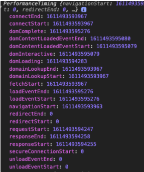

## 0. 이글을 작성하는 이유?

- [프론트앤드 관련 강의](https://www.fastcampus.co.kr/dev_red_ktg)를 듣다가 웹 페이지 로드 과정에 대해서 설명해주셨는데 한번 정리하고 싶어서!
- 플랫폼이 어떤 순서로 페이지를 로드하는지, 어떤 이벤트들이 발생하는지 궁금해서!
- Navigation Timing API에서 제공하는 property가 어떤걸 의미하는지 알고 싶어서!
- 성능 이슈는 웹 브라우저의 동작과 관련이 있기때문에 미리 정리하고 싶어서!

## 1. Navigation Time Level 2 Spec

- 노란색 부분은 웹페이지에서 벗어난 후 문서를 읽어들이기 전, 자바스크립트 이벤트는 없고 전부 네트워크 레벨에서 일어나는 일

  ### 1) Prompt for unload (unloadEventStart, unloadEventEnd)

    - 현재 페이지에서 다른 페이지로 이동할때 발생
    - 현재(보고 있던) 페이지를 unload (window: beforeunload 발생)

      

  ### 2) Redirect (redirectStart, redirectEnd)

    - 서버쪽에서 redirect 신호가 오면 발생한다.(HTTP code 301, 302)
    - optional이라서, 발생하지 않을 수 도 있음.

  ### 3) AppCache (fetchStart)

    - 실제로 서버에서 데이터를 읽어오기 전에 브라우저 캐시의 저장된 데이터가 있는지 확인

  ### 4) DNS(domainLookupStart, domainLookupEnd)

    - DNS에 요청을 보내기 전에 먼저 Browser에 해당 Domain이 cache돼 있는지 확인

      (Chrome의 경우 chrome://net-internals/#dns 에서 확인 가능)

    - 없을 경우, 로컬에 저장돼 있는 hosts파일에서 참조할 수 있는 Domain이 있는지 확인
    - 없을 경우, 마지막으로 네임서버를 조회해서 서버의 실제 IP를 확인

  ### 5) TCP (connectStart, secureConnectionStart, connectEnd)

    - DNS단계에서 알아낸 IP를 통해 TCP로 서버에 연결(TCP 통신을 통해 Socket을 연다)
    - [관련 링크](https://owlgwang.tistory.com/1)

  ### 6) Request (requestStart, requestEnd)

    - HTML 문서에 대한 요청

  ### 7) Response (responseStart, responseEnd)

    - Response의 첫번째 바이트가 수신한 직후 응답 시간이  체크된다. (start)
    - 마지막 바이트를 받은 직수 응답 완료 시간이 체크된다. (end)
    - **웹페이지에서 사용할 HTML 파일을 받음!**

  ### 8) Precessing(domInteractive, domContentLoadedEventStart/End, domComplete)

    - 파일(HTML, CSS, JS, img 파일)을  파싱하고 렌더링단계까지 포함
    - domInteractive : 모든 HTML 및 DOM 생성 작업이 완료
    - domContentLoadedEvent :
        - DOM 및 CSSDOM이 모두 준비된 시점**, 화면에 그리기 전!!! 렌더링 트리 생성전!!**
        - 여기서 자바스크립에서 기능을 추가
        - 많은 자바스크립트 **프레임워크 로직의 트리거가 domContentLoaded**
    - domcomplete : 페이지 및 해당 하위 리소스가 모두 준비된 시점

  ### 9) Load(loadEventStart, loadEventEnd)

    - 서브리소스(이미지, 동영상)까지  모두 다운로드 받고  읽은  단계 (window load이벤트 발생)

## 3. window.performance.timing

- 개발자 도구에서 쉽게 window객체에 접근해서 확인할 수 있다.
- 해당 페이지가 로딩되면서 각 이벤트를 대한 시간을 UNIX타임으로 제공한다.

    

## 4. 관련 출처

- [https://developer.mozilla.org/ko/docs/Navigation_timing](https://developer.mozilla.org/ko/docs/Navigation_timing)
- [https://www.w3.org/TR/navigation-timing-2/#processing-model](https://www.w3.org/TR/navigation-timing-2/#processing-model)
- [https://developers.google.com/web/fundamentals/performance/critical-rendering-path/measure-crp?hl=ko](https://developers.google.com/web/fundamentals/performance/critical-rendering-path/measure-crp?hl=ko)
- [https://owlgwang.tistory.com/1](https://owlgwang.tistory.com/1)
