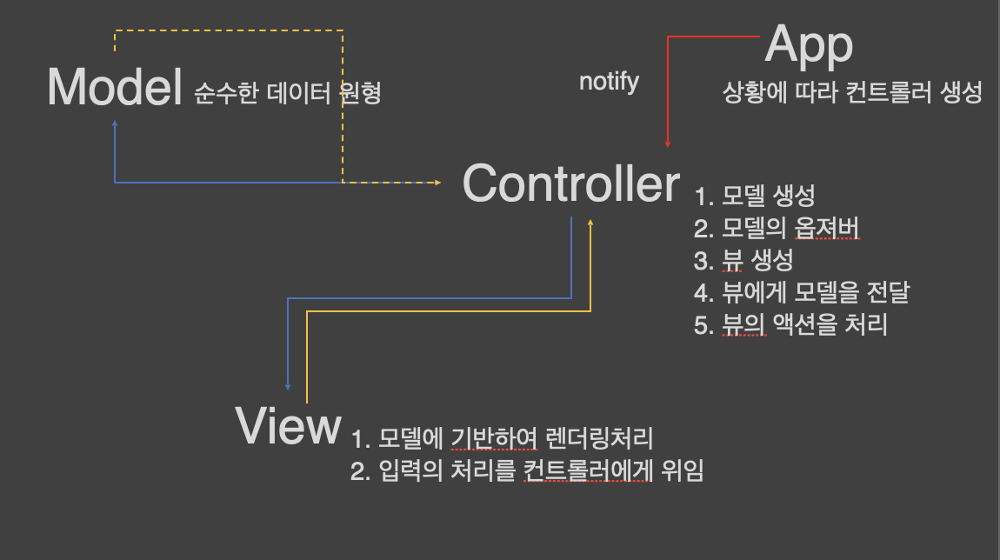

> Singleton Pattern : 단 하나의 인스턴스만 생성되고 사용되어 진다.

1. WeakMap을 통해서 쉽게 구현할 수 있다.
    - Map과 다른점은 객체만 key로 쓸수있다.(Map은 Key가 리터럴)
    - Key에 참조값만 넣을 수 있다! ⇒ Key가 객체이다
    - 어떤 객체를 기반으로 무언가 값을 얻어내고 싶으면, WeakMap 사용
    - weakMap의 내장 메소드를 에러처리

   ES6 부터는 부모 클래스 인스턴스를 만들고 자식을 참조한다
   프로토 타입 체인이 아니다 → 인스턴스 방향이 바뀜

    ```jsx
    const Singleton = class extends WeakMap{
      has(){err()};
      get(){err()};
      set(){err()};
      getInstance(v){
        if(!super.has(v.constructor)) super.set(v.constructor, v);
        return super.get(v.constructor);
      }
    }
    ```

2. 생성자 특성을 활용하여 싱글톤 구현

   **자바스크립트 생성자 특성 ⇒ new 라는 키워드를 통해 생성자를 호출하면?**
    -  리턴값이 원시형이거나 or 없으면  → 새롭개 생성된 객체에 **this bind**
    -  객체를 반환하면, 반한되는 객체에 **this bind**

    ```jsx
    const singleton = new Singleton;

    const Test = class {
      constructor (isSingleton) {
        if(isSingleton) return singleton.getInstance(this);
      }
    }

    const test1 = new Test(true), test2 = new Test(true), test3 = new Test;
    console.log(test1 === test2); // true
    console.log(test2 === test3); // false

    class A{
      constructor(){
        return []
      }
    }

    // super에 갔다오면 this가 변한다!!!!
    class B extends A{
      constructor(){
        super();
        console.log(Array.isArray(this));
      }
    }

    const b = new B; //true 

    ```

> OOP에서 제일 큰 유혹 → static을 만들자

1. Singleton Class를 static 하게 구현했다?
    - 단 하나 인스턴스만을 만들 수  있다
    - 똑같은 스태틱은 그 인스턴스 하나로 환원된다
2. 기존의 Singleton Class
    - 상황에 맞게 인스턴스를 만들어, 상황에 맞게 분리할 수 있다.
3. **객체지향은 컨텍스를 사용한다 ( 컨택스트는 인스턴스에서 발생한다)**
    - 클래스 소속된 Static 또한 컨텍스트이긴 하지만.. OOP가 원하는게 아님
    - 인스턴스의 컨텍스트를 원하는거다.
    - 객체들은 객체망을 구성 → 의존성 분리 → 협력을 통해 문제 해결
4. 언제 유혹에 빠질까????
    - 내가 그 인스턴스의 참조를 줄 방법이 없다. (방법이 없는데 클래스는 어떻게..)
    - 커뮤니케이션을 설계하고 싶지 않을때 그 유혹에 빠진다.
5. **Util 함수는 예외 → 하지만, 과연 Util인지 생각해보자(거의 아님)**

---

### MVC - MODEL VIEW CONTROLLER

1. **Controller의 역할**
    1. Model 생성(or 가져오거나)
    2. Model의 옵저버 (**의존성을 낮추기 위해** **Observer Pattern)**

       **Model의 옵저버 역할**
        - Model이 변경되면 Model만 알고 있다 (정확도)
        - View에게 전달하여 새롭게 Render 하기 위해

    3. View 생성 (생성만 하고 처리는 View의 역할)
    4. View에게 Model을 전달

       **View에게 Model의 변화를 직접 수신하여 렌더링 하면 되지 않을까?**
        - View는 전체 공정중에 일부분만 담당한다
        - Controller가 전체 공정을 다 알고 있다 (제왕적 컨트롤러)
        - Controller의 추가적인 작업(데이터 후처리)이 필요하다(..수도 있다)

    5. View의 액션을 처리 (EventListner 처리)

   **Contoller의 역할은 Model을 가지고 View를 그린다**

2. **View의 역할**
    1. Model에 기반하여 렌더링 처리
    2. 입력의 처리를 컨트롤러에게 위임

       **View 누구를 알고 있을까?**
        - 그림을 그리기 위해서 Model을 알고 있다. (Controller 에게 받음)
        - 입력(EventListner)을 처리하기 위해 Controller를 알고 있다.

3. **Model 역할 (순수한 데이터 원형)**
    1. Model의 변화를 Controller에게 통보
    2. Model이 Subject → Controller가 Model의 Observer **(Observer Pattern)**
4. **App의 역할**
    1. 상황에 따라 Controller 생성
    2. 여러가지 라우팅 정보를 기반으로 Controller 생성
    3. 생성 후 Controller 역할 시작!



**MVC, MVM, MVVM 의 차이점은 VIEW 와 MODEL의 관계에서 나온다.**

**Controller에 추상층을 넣어, Model의 상황에 따라 공급해 주는 서비스**

---

### Model

- 의존성이 없기 때문에 구현하기 쉽다
- 페이지가 변경되도 똑같은 모델을 움직여야하니까 ⇒ 싱글톤

    ```jsx
    const Model = class extends Set{
      constructor (isSingleton) {
        super();
          if(isSingleton) return singleton.getInstance(this);
      }

      add(){err();}
      delete(){err();}
      has(){err();}
      addController(v){
        if(!is(v, Controller)) err();
        super.add(v);
      }
      removeController(v){
        if(!is(v, Controller)) err();
        super.delete(v);
      }
      notify(){
        this.forEach(v => v.listner(this))
      }
    }

    const HomeDetailModel = class extends Model{
      constructor (_id = err(), _title = err(), _memo = '') {
        super();
        prop(this, {_title, _id, _memo});
      }
      get title(){return this._title;}
      get id(){return this._id;}
      get memo(){return this._memo}
    }

    const HomeModel = class extends Model{
      constructor (isSingleton) {
        super(isSingleton);
        // this singleton
        // 대부분 여기서 어떤 작업?  ajax 통신으로 json 가져와서 parsing
        if(!this._list) prop(this, {_list : [
            new HomeDetailModel(1, 'todo1', 'memo1'),
            new HomeDetailModel(2, 'todo2', 'memo2'),
            new HomeDetailModel(3, 'todo3', 'memo3'),
            new HomeDetailModel(4, 'todo4', 'memo4'),
            new HomeDetailModel(5, 'todo5', 'memo5'),
          ]})
      }
      add(...v){this._list.push(...v);}
      remove(id){
        const {_list: list} = this;
        if(!list.some((v, i) => {
          if(v.id === id){
            list.splice(i, 1);
            return true;
          }
        })) err();
        this.notify();
      }

    	get list () {return [...this._list]}

      get(id) {
        let result
        if (!this._list.some(v => v.id === id ? (result = v) : false)) err()
        return result
      }
    }
    ```

### View

- View 싱글톤 (render할때 model을 받아서 처리)
- Controller는 입력을 처리하고, 모델을 처리하기 위해 존재
- Controller 메서드명의 분리
    - View가 화면을 그릴때도 메서드가 발동
    - View 액션을 처리할때도 메서드가 발동

```jsx
const View = class{
  constructor (_controller = err(), isSingleton = false) {
    prop(this, {_controller});
    if(isSingleton) return singleton.getInstance(this);
  }
  render(mode = null){override();}
}

const HomeBaseView = class extends View {
  constructor (controller, isSingleton) {
    super(controller, isSingleton);
  }
  render(model = err()){
    if(!is(model, HomeModel)) err();
    const {_contoller : ctrl } = this;
    return append(el('ul'), ...model.list.map(v => append(
      el('li'),
      el('a', 'innerHTML', v.title, 'addEventListener', ['click', _=>ctrl.$detail(v.id)]),
      el('button', 'innerHTML', 'x', 'addEventListener', ['click', _=>ctrl.$remove(v.id)] )
    )));
  }
}

const HomeDetailView = class extends View{
  constructor (controller, isSingleton) {
    super(controller, isSingleton);
  }
  render(model = err()){
    if(!is(model, HomeDetailModel)) err();
    const {_contoller : ctrl } = this;
    return append(el('section'),
      el('h2', 'innerHTML', model.title),
      el('p', 'innerHTML', model.memo),
      el('button', 'innerHTML', 'delete', 'addEventListener', ['click', _=>ctrl.$removeDetail(v.id)]),
      el('button', 'innerHTML', 'list', 'addEventListener', ['click', _=>ctrl.$list()]),
    )
    }
}
```

> Model**이 변경되면 즉시 View에 영향이 끼친다 → 커플링 (MVC 단점)**

### - View가 Model을 모르게 하는 방법 (디커플링)

1. **View 모든 필드에 대해서 getter/setter를 제공**
    - Controller는 View의 getter/setter를 호출하면 끝
        - 위와 같은 Controller를  `**Presenter Controller**`
    - 장점
        - View가 Model을 모르니, Model의 변화가 View에 영향 X
        - 실제 모델이 없어도, 메서드만 호출하면 View를 만든다
    - 단점
        - View가 커지면 수많은 필드에 getter/setter를 만들어야 한다.
        - ide가 만들어주는데 직접 만들기는 어렵다.
        - 수동적인 View의 형태
    - 이러한 **패턴은 MVP**라고 부르며, 비쥬얼 베이직, 델파이에서 사용
2. **View가** Model**을 알게 하는게 아니라 → 가짜 모델이 View를 알게 바인딩**
    - 가짜 모델이 주도적으로 View를 업데이트 한다!
    - 장점
        - View를 가짜 모델을 이용해서 업데이트하여, Model의 변화가 View에 영향 X
        - 가짜모델이 View를 보고 key에 데이터 바인딩을 통해서 업데이트 한다
        - 바인딩하는 엔진이 있으면,  getter/setter를 만들지 않아도 된다!
    - 단점
        - View과 가짜 모델과 원할하게 상호작용할 수 있는 시스템 필요(바인딩 엔진)
        - 예시 (Vue.js)

            ```jsx
            // v-model을 통해 가짜 모델을 통해 상호작용하여 화면을 그린다.
            // v-model은 View를 바꾸기 위한 이름이지, Model 이름이 아니다 
            <input type="checkbox" id="checkbox" v-model="checked">
            <label for="checkbox">{{ checked }}</label>
            ```

   **가짜 모델은 무엇이며, 어떻게 만들까?**
    - 1차 : 서버에서 JSON (실제 Model)
    - 2차 : JSON을 View를 업데이트 하기위한 key로 **재정의한 객체
      -** View를 업데이트하기위해 Model을 재정의하는 것을 **View Model!
    - 가짜 모델 ===** **View Model**

    - 이러한 **패턴은 MVVM**라고 부르며, 모던 프론트앤드 프레임워크에서 사용

   ### Controller

    - 클래스로 구현한다면, **메소드 하나가 화면 하나**를 담당

      **base() , default() 기본 화면 보여주는 default Method
      -** 디폴트 메서드 이름을 정하는 일반적인 시스템의 룰
        - Home 컨트롤러의 기본 화면을 보여줘 →  **default Method**

    - **화면이나 스테이지를 전환하는 것은 어플리케이션의 역할(라우팅 요청)**

        ```jsx
        const Home = class extends Controller {
          constructor (isSingleton) {super(isSingleton)}

          base () {
            const view = new HomeBaseView(this, true)
            const model = new HomeModel(true)
            return view.render(model)
          }

          $detail (id) {app.route('home:detail', id)}

          $remove (id) {
            const model = new HomeModel(true)
            model.remove(id)
            this.$list()
          }

          detail (id) {
            const view = new HomeDetailView(this, true)
            const model = new HomeDetailModel(true)
            return view.render(model.get(id))
          }

          $list () {app.route('home')}

          $removeDetail (id) {
            this.$remove(id)
            this.$list()
          }

        }
        ```

   ### App

    1. MVC에서는 App의 라우팅을 통해 화면은 전환한다.
        - 컨트롤러 단에서 화면을 전환할 수 없다.
    2. 라우팅 될때마다 부모를 비우고 컨트롤러의 호출 결과를 넣어준다.
        - 반드시 App을 경유해서 화면을 전환하고 있기 때문
        - 컨트롤러가 화면을 바꾸거나 뷰가 모델을 수신해서 뷰을 갱신하는게  의미없다.

   **실무에서는 라우팅을 등록할때, 함수를 등록하는 일반적**
    - 두번째 인자의 함수를 주는 이유는 실행할때 어떠한 액션을 추가할 수 있다.

    ```jsx
    const App = class{
      constructor (_parent = err()) {
        prop(this, {_parent, _table : new Map})
      }
      add(k = err(), controller = err()){
        k = k.split(':');
        this._table.set(k[0], controller);
        (k[1] || '').split(',').concat('base').forEach(v => this._table.set(`${k[0]}:${v}`, controller));
      }
      route(path = err(), ...arg){
        const [k, action = 'base'] = path.split(':');
        if(!this._table.has(k)) return;
        const controller = this._table.get(k)();
        append(attr(sel(this._parent), 'innerHTML', ''), controller[action](...arg));
      }
    }

    const app = new App('#stage');
    app.add('home:detail', _=>new Home(true));
    app.route('home')
    ```

   격리와 역할로 나눠 코드의 수정이 제안된 요건내에서 일어나게 바꾼다.

   모델 뷰 컨트롤러로 나눠서 하나의 화면을 구성하는 이슈를 3가지로 나누었고,

   각각 수정의  각각에서 나오게 만들었다. 이게 MVC

   > **MVC란?**
   격리와 역할로 나눠 코드의 수정이 제안된 요건내에서 일어나게!
   모델, 뷰, 컨트롤러로 나눠 하나의 화면을 구성하는 이슈를 3가지로!
   각각 수정의 각각에서 나오게 만들었다

   ### Observer

    - listen을 구현해서 각 모델의 notify를 받아서 처리한다.

   **Controller에서 View용 리스너를 용어 : action,  listner,  handler**

    ```jsx
    const Home = class extends Controller {
      constructor (isSingleton) {super(isSingleton)}

      base () {
        const view = new HomeBaseView(this, true)
        const model = new HomeModel(true)
        return view.render(model)
      }

      $detail(id){
        app.route('home:detail', id);}

      $remove (id) {
        const model = new HomeModel(true)
        model.remove(id)
        this.$list()
      }

      detail(id) {
        const view = new HomeDetailView(this, true)
        const model = new HomeModel(true);
        return view.render(model.get(id));
      }

      $list () {app.route('home')}

      $removeDetail (id) {
        this.$remove(id)
        this.$list()
      }
    ```

### 참고사항
- 어디에서 불러내고 요청되도 Singleton을 유지해야 한다.
- 어떤 객체든지, 싱글턴을 만들 방법이 필요하다.

- App 개발에서 메모리 Context에 따라 대표적인 세가지의 Singleton 형태
    1.   Application Memory : 서버가 죽을때까지의 메모리
    2.  Session Memory : 유저가 로그인하고 로그아웃 할때까지의 메모리
    3.  Request  Memory : 하나의 요청당 하나의 메모리
- **백앤드에서 MVC + rest api가 좋은 이유는?**
    - Model이 바뀌면 JSON key/value 만 추가하면 된다
    - View는 프론트앤드 개발자 그려줄거니까 ㅠㅠ
