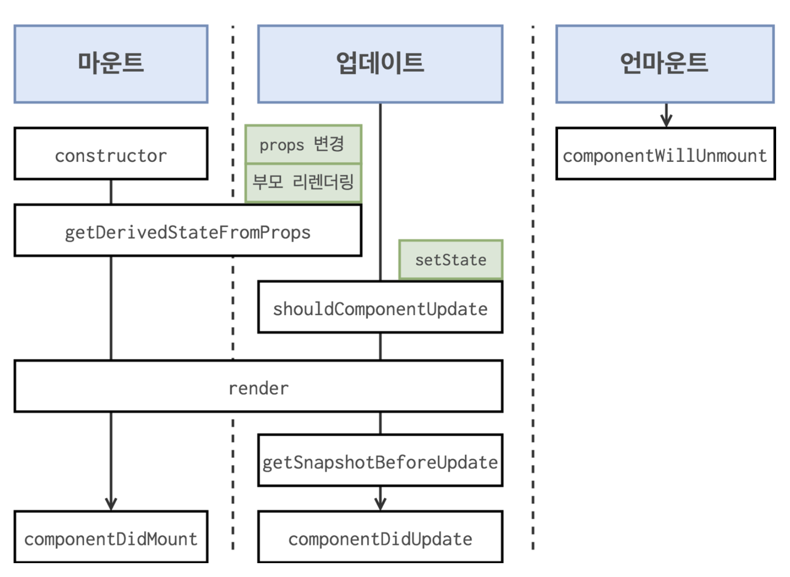

## [클래스 컴포넌트 생명주기](https://ko.reactjs.org/docs/state-and-lifecycle.html)

## 생명주기 API : 클래스 컴포넌트에서 사용되는 

[참고자료](http://projects.wojtekmaj.pl/react-lifecycle-methods-diagram/)

1. 마운트 단계 
    - constructor
        - constructor는 컴포넌트가 브라우저에 나타나기전에 호출
        - render() 전에 호출
            ```js
            constructor(props) {
            super(props);
            }
            ```
    - componentDidMount
        - componentDidMount는 브라우저에 반영이 되고 나서 호출
        - 컴포넌트에서 필요로 하는 데이터 요청을 위해 외부 api 호출(axios, fetch)
            ```js
            componentDidMount() {
            // 외부 라이브러리 연동
            // 외부 api호출, DOM 에 관련된 작업 등
            }
            ```
2. 업데이트 단계
    - shouldComponentUpdate
        - 최적화를 위해서 사용
        - 가상돔은 변화를 감지하면 다시 그려지는데 전에 있던 state, prop의 값 비교로 true, false로 작동(기본값 : true)
            ```js
            shouldComponentUpdate(nextProps, nextState) {
            // return false 하면 업데이트를 안함
            return true;
            // 기본적으로는 true를 반환
            }
            ```
    - componentDidUpdate
        - render() 호출이후 발생
        - 이 시점에는 this.props, this.state가 변화된 상태
        - 파라미터를 통해 prevProps 와 prevState 를 조회
            ```js
            componentDidUpdate(prevProps, prevState, snapshot) {
            }
            ```
3. 언마운트 단계
    - componentWillUnmount
        - 이벤트 및 외부 라이브러리 호출등을 제거하기 위해 사용
            ```js
           componentWillUnmount() {
            // 이벤트 및 연동된 외부 라이브러리 제거
            }
            ```        
