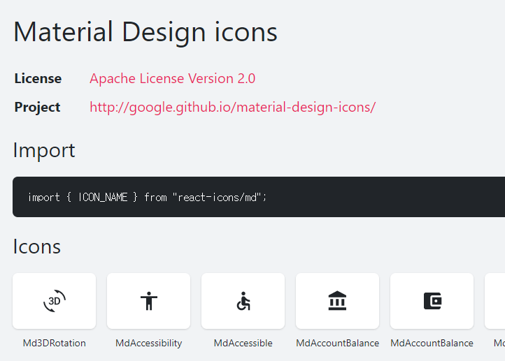

## [React-icon](https://react-icons.netlify.com/)
- 다운로드수 : 41만
- 버전 : 3.9.0
- 최근업데이트 : 1달전
1. 정의 : 리엑트를 사용하기 쉽게 아이콘을 컴포넌트화 시킨 모듈

2. 사용법
    - 모듈 설치
    ```bash
        $ npm install react-icons --save
    ```
    - 사이트에서 자기가 사용한 아이콘 확인
        

    - 사용할 컴포넌트에서 import 문을 통해 아이콘을 가져와 사용한다.
    
    ```jsx
    import { MdAccessibility } from 'react-icons/fa';

    class Question extends React.Component {
        render() {
            return <h3> Lets go for a <MdAccessibility />? </h3>
        }
    }
    ```

    - 컴포넌트의 속성
        - color	undefined (inherit)	
        - size	1em	(사이즈 변경 가능)
        - className	
        - style	
        - attr

