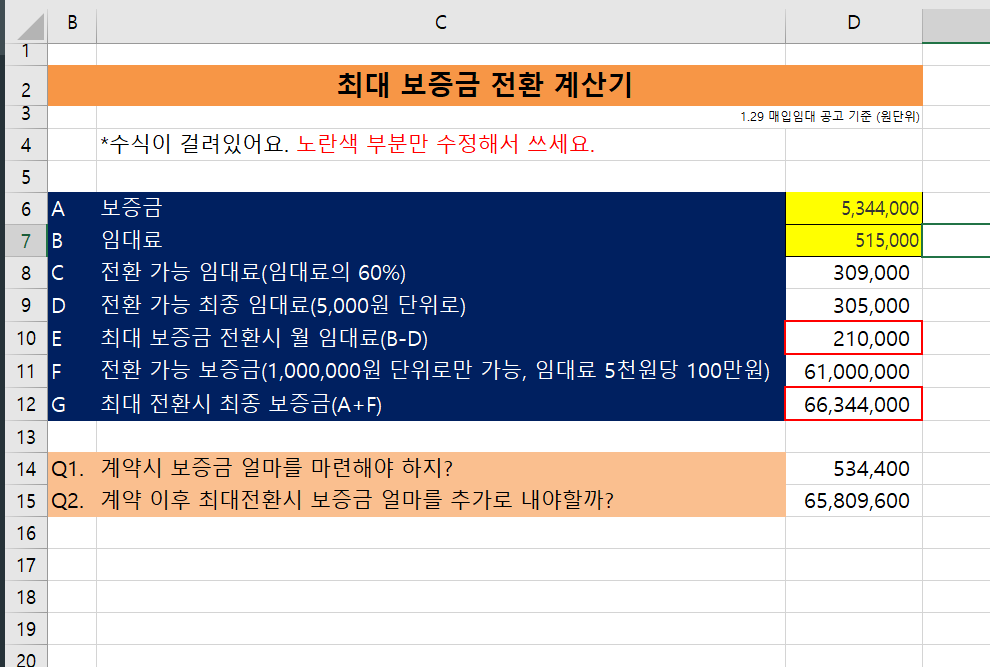

## [임대보증계산기](https://lhcalculation.netlify.app)

1. 프로젝트 계기
    - LH 임대보증금 계산기가 엑셀파일로 되어 있어, 항상 임대보증금 계산을 하려면 엑셀을 다운받아서 계산을 하였다. 엑셀을 보면 수식을 간단했고, 굳이 다운을 받는것보다 간단하게 gitpage로 만들어 배포를 하면 누군가는 이용한 서비스 일것 같아 시작하게 되었다.

2. 요구사항 분석
    - 사용자가 입력하는 보증금과 임대료로 인해 최대 전환 보증금 및 임대료를 계산하는거다
    - state => 보증금, 임대로

3. 디자인 가이드
    - 기본적인 계산기

3. 디자인 가이드
    - 원본 엑셀파일

    
    - 디자인

    

4. 개발 및 후기
    - 클래스 컴포넌트와 함수형 컴포넌트를 혼합으로 사용해서 조금씩 함수형 컴포넌트로 넘어가려고 시도중이다. 누군가를 위해 만든 프로젝트라서 뿌듯했다.
    - 처음에는 리덕스로 만들려고 하였지만, 단순 state변경이라서 리덕스에서 함수형 컴포넌트를 사용하는 것으로 바꾸어 프로젝트를 진행하였다.

5. 사이트 : <https://lhcalculation.netlify.app/>
