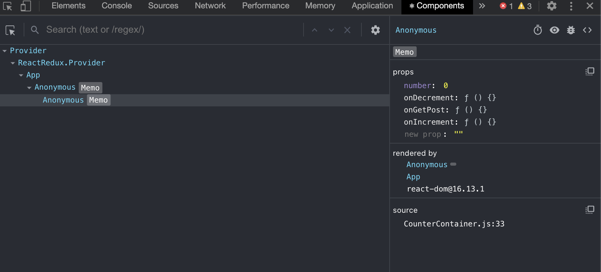

## How to Debugging with React
1. `debugger` keyword
    - debugger 키워드에서 flow가 멈춘다.
    - 개발자도구 Soures 탭에 해당 파일과 debugger 키워드 위에 어떻게 값이 들어오는 확인가능
    - 현재 Call Stack / Scope(Local / Global 변수 리스트 확인가능)을 확인가능
    - 또한 Console의 상태는 현재 컨텍스트이기 때문에 Scope에 있는 변수를 적어 바로바로 확인가능
    - Breakpoint로는 작동이 안되는데...내가 못하는것 같지만 이것으로도 충분하다고 판단
        ```js
        export default handleActions({
            [increment]: (state, action) => produce(state, draft => {
              debugger;  // 이부분에서 플로우가 스탑이 된다.
                draft.number += action.payload.number;
            }),
            [DECREMENT]: (state, action) => produce(state, draft => {
                draft.number -= action.payload.number
            })
        }, initialState)
        ```
2. React-devtools extension 사용
          
    - Components 탭을 이용해 props와 state를 확인하고 변경가능하다.
        - component 우측에 있는 3가지 버튼을 활용하면 좋다
        - Inspect : 어떤 HTML 태그를 렌더링 됬는지 Element 태그로 이동하여 알려준다.
        - Debugging : 해당 컴포넌트의 정보를 console 태그에 알려준다.
        - View Soure : 해당 컴포넌의 jsx 파일 알려준다.
    - Profiler 탭을 이용해서 최적화가 됬는지 안됬는지 확인할 수 있다.
        - useMemo, useCallback을 쓰고 나서 얼마나 효과가 있는지 확인 할 수 있다.
        - 녹화버튼을 눌러 해당 컴포넌트의 렌더링/이벤트을 녹화하여 시간을 알려준다.

3. Redux-devtools extension 사용        
    - store 설정시 extension을 활성화 시킬 수 있다.
    - 액션 및 페이로드에 대한 상태를 직관적으로 확인 할 수 있으며, 타임머신 기능을 통해 그 전 상태로 돌아갈 수 있다.
    - 자세한 사용법은 인터넷을 참고하면 좋을것 같습니다. 
    
