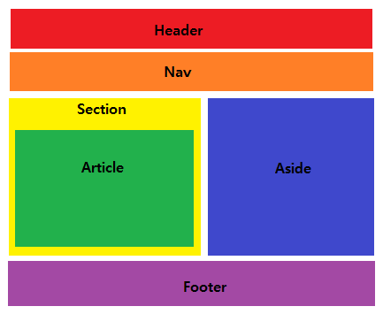

## 정의

1. 장애인, 비장애인을 포함한 모두가 사용할 수 있도록 웹사이트를 디자인, 개발하는 것을 의미한다.
2. 스크린리더를 이용하는 사람, 키보드만 이용하는 사람들이 사용 할 수 있게 만드는 것
3. React는 HTML을 이용하여 구현가능

## 표준 및 지침

1. WCAG(Web Content Accesibility Guidlines)
2. WAI - ARIA
    1. aria-* HTML 속성을 이용하여 구현을 한다.
    2. JSX에서는 다른 HTML 속성과는 다르게 hypen-case로 구현(원래는 camelCase)

## 시맨틱 태그를 이용하여 웹 접근성 기초 구현

1. `<div>` 로만 컴포넌트를 구현을 할 경우 웹 접근성의 의미가 없으므로 시맨틱 태그를 활용하여 작성한다.
2. `<ul>`, `<ol>` 태그 같은 리스트 태그 같은 경우 `<React.Fragment>` 태그를 이용한다. 

    ```jsx
        import React, { Fragment } from 'react';

        function ListItem({ item }) {
          return (
            <Fragment>
              <dt>{item.term}</dt>
              <dd>{item.description}</dd>
            </Fragment>
          );
        }

        //Fragment의 props가 없으면 <></> 태그로 사용가능

        function Glossary(props) {
          return (
            <dl>
              {props.items.map(item => (
                <ListItem item={item} key={item.id} />
              ))}
            </dl>
          );
        }

        export default Glossary; 
    ```

## `<Input> <textarea>` 같은 폼태그
1. form 컨트롤 같은 경우 입력창이기 때문에 스크린리더가 읽을 수 있는 속성이 없기 때문에 `<label>` 태그를 이용한다.
2. JSX에서는 for가 아니고 htmlFor로 작성하여한 한다.
    ```JSX
    <label htmlFor="namedInput">name:`</label>
    `<input id="namedInput" type="text" name="name"/>
    ```

## 성공 / 오류 (W3C 기준)

- `<h1>` 태그로 해당 process의 상태를 표시
- `<title>` 태그를 이용(`<tiitle>` 태그는 스크린 리더가 제일 먼저 태그이기 때문이다.)
- window.alert을 이용
- 페이지 상단에 오류에 대한 정보를 보여준다(role='alert'으로 작성해주어야 한다)
- input 태그 옆으로  바로 성공/오류에 대한 상태를 표시해준다.
- 입력을 하고 있는 중이라면 5번과 같이 태그 옆에 해당 입력값의 상태를 표시해 준다.

## 포커스 컨트롤

### 키보드 포커스와 포거스 윤곽선

- 키보드(tab , shift+tab)을 이용하여 포커스를 이동시킬 수 있다.
- 포커스 이동시, 태그의 윤곽성이 표시된다.

### 원하는 콘텐츠로 건너뛸 수 있는 방법

- `<a>` 태그를 이용하여 원하는 콘텐츠로 이용가능

    ```jsx
    <a href="hello">Go to Hello </a>

    <h1 id="hello">Hello </h1>
    ```

- 시멘틱 태그를 이용하여 페이지 영역을 나눈다.

    

### ref를 이용한 포거스 관리

- ref를 props로 이용

    ```jsx
    function CustomTextInput(props) {
      return (
        <div>
          <input ref={props.inputRef} />
        </div>
      );
    }

    class Parent extends React.Component {
      constructor(props) {
        super(props);
        this.inputElement = React.createRef();
      }
      render() {
        return (
          <CustomTextInput inputRef={this.inputElement} />
        );
      }
    }

    // 이제 필요할 때마다 포커스를 잡을 수 있습니다.
    this.inputElement.current.focus();
    ```

- [react-aira-modal](https://github.com/davidtheclark/react-aria-modal) 이용하여 포커스 관리

## 마우스와 포인터 이벤트
- 마우스/포인터 이벤트를 기준으로 컴포넌트를 작성한다면, 키보드 사용자의 사용성을 해칠 수 있다.
- 해결책은 focus를 이용하여 해결한다(onBlur = 포커스를 잃었을때, onFocus = 포커스를 가질때)

    ```jsx
    class BlurExample extends React.Component {
    	timeOutId = null;
      state = {
    		isOpen : false
    	};

      onClickHandler = () => {
        this.setState(currentState => ({
          isOpen: !currentState.isOpen
        }));
      }

      // setTimeout을 사용해 다음 순간에 팝오버를 닫습니다.
      // 엘리먼트의 다른 자식에 포커스가 맞춰져있는지 확인하기 위해 필요합니다.
      // 새로운 포커스 이벤트가 발생하기 전에
      // 블러(blur) 이벤트가 발생해야 하기 때문입니다.
      onBlurHandler = () => {
        this.timeOutId = setTimeout(() => {
          this.setState({
            isOpen: false
          });
        });
      }

      // 만약 자식이 포커스를 받으면, 팝오버를 닫지 않습니다.
      onFocusHandler() {
        clearTimeout(this.timeOutId);
      }
      render() {
        // React는 블러와 포커스 이벤트를 부모에 버블링해줍니다.
        return (
          <div onBlur={this.onBlurHandler} onFocus={this.onFocusHandler}>
            <button
              onClick={this.onClickHandler}
              aria-haspopup="true"
              aria-expanded={this.state.isOpen}
            >
              Select an option
            </button>
            {this.state.isOpen && (
              <ul>
                <li>Option 1</li>
                <li>Option 2</li>
                <li>Option 3</li>
              </ul>
            )}
          </div>
        );
      }
    }

    ```

    ## ARIA를 이용한 웹 접근성 향상
    - 스크린 리더 및 보조기기가 aria 속성을 읽어 컴포넌트의 현재!! 실시간!!의 상태를 알 수 있다
    - aria속성을 이용하여  태그의 역할, 속성, 상태를 표시한다.(aria-selected="true/ false")
    - tabindex 속성을 이용하여 포커스를 조정 할 수 있다(-1 : 받지 않을때, 0 : default, 1 : 우선적으로)
    - role 속성을 이용하여  div 태그를 시멘틱 태그처럼 사용 가능

    ## 기타 사항

    ### 언어 설정
    - lang 속성을 이용하여 스크린 리더가 어떤 언어로 해석하고 읽어줄지 설정 가능

    ### 문서 제목 설정
    - react-helmet을 이용하여 title 및 meta 태그 설정가능

    ### 색대비
    - 저시력자가 볼 수 있도록 충분한 색 대비를 주어야 한다.

    ## 테스트
    1. 키보드로 테스트
        1. 마우스의 연결을 해제하세요.
        2. `Tab`과 `Shift+Tab`을 사용해 이동하세요.
        3. `Enter`를 사용해 엘리먼트를 활성화하세요.
        4. 메뉴와 드롭다운과 같은 일부 엘리먼트는 필요하다면 키보드 방향키를 사용해 조작합니다.
    2. voice over를 사용하여 테스트
