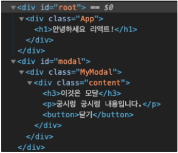
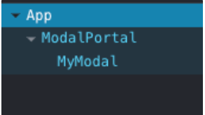

- 정의 : Portal은 컴포넌트를 DOM 어디든지 만들어줄수 있는 기능
- 범위 :  Root 컴포넌트 안/밖 어디든지 (주로, modal/dialog 창 같이 style을 독립적으로 사용하기 위해)
- 사용법

```jsx
const Portal = ({ children }) => {
  const el = document.getElementById('my-portal');
	// index.html 기준
  return ReactDOM.createPortal(children, el);
}

return (
	<Portal>
		<Hello> // Portal 시킬 엘리먼트
	</Portal>
)
```

- 만약!! ref를 전달해야 할 사항이라면??(forwardRef를 사용하자)

```jsx
const Tooltip = forwardRef((props, ref) => (
createPortal(
        <div ref={ref}>{props.children}</div>,
		    document.getElementById('modal')
    )
));

const Info = () => {
    const ref = useRef()
    return (
        <Tooltip ref={ref}>
            My content
        </Tooltip>
    )
}
```

### 개발자 도구에서 확인
1. Chroem 개발자 도구 Elements Tap
    - 원하는 element에 렌더링


2. 리엑트 개발자도구 Components
     - React Tree에서는 자식으로 위치
     - 부모 === ModalPortal을 가지고 있다.


- 이벤트 버블링은 어떻게 캐치할까?
    - 리엑트에서는 자식이 portal 이든지 상관하지 않는다(어차피 React Tree에 존재)

    ```jsx
    class App extends Component {
      state = {
        modal: false
      };
      handleOpenModal = () => {
        this.setState({
          modal: true
        });
      };
      handleCloseModal = () => {
        this.setState({
          modal: false
        });
      };
      render() {
        return (
          <div className="App">
            <h1>안녕하세요 리액트!</h1>
            <button onClick={this.handleOpenModal}>모달 열기</button>
            {this.state.modal && (
              <ModalPortal>
                <MyModal onClose={this.handleCloseModal} />
              </ModalPortal>
            )}
          </div>
        );
      }
    }

    export default App;

    import React from 'react';
    import './MyModal.css';

    const MyModal = ({ onClose }) => {
      return (
        <div className="MyModal">
          <div className="content">
            <h3>이것은 모달</h3>
            <p>궁시렁 궁시렁 내용입니다.</p>
            <button onClick={onClose}>닫기</button>
          </div>
        </div>
      );
    };

    export default MyModal;
    ```
