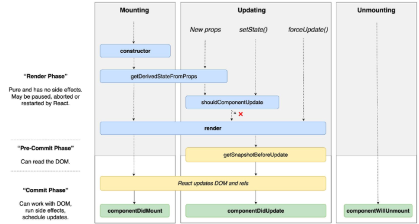

'Strick Mode'는 UI를 렌더링하지 않으며, <React.StrickMode> 하위 컴포넌트에 대한 부가적인 검사(아래 설명)를 통해 경고 한다.

- Strick Mode는 develop Mode에서는 작동되지만, production Mode에서는 작동하지 않는다.

### Strick Mode 검사하는 부분

- 안전하지 않은 생명주기를 사용하는 컴포넌트 발견
- 레거시 문자열 ref 사용에 대한 경고
- 권장되지 않는 findDOMNode 사용에 대한 경고
- 예상치 못한 부작용 검사
- 레거시 context API 검사

### 1. 안전하지 않은 생명주기를 사용하는 컴포넌트 발견?

- React가 계속해서 업데이트(현재 v17.0.1)를 하면서 기존에 쓰이던 lifecycle Method가 deprecate되거나 다른 Method로 대체되는경우가 있는데 아래와 같다.
  - **16.3**: Introduce aliases for the unsafe lifecycles, `UNSAFE_componentWillMount`, `UNSAFE_componentWillReceiveProps`, and `UNSAFE_componentWillUpdate`. (Both the old lifecycle names and the new aliases will work in this release.)
  - **A future 16.x release**: Enable deprecation warning for `componentWillMount`, `componentWillReceiveProps`, and `componentWillUpdate`. (Both the old lifecycle names and the new aliases will work in this release, but the old names will log a DEV-mode warning.)
  - **17.0**: Remove `componentWillMount`, `componentWillReceiveProps`, and `componentWillUpdate` . (Only the new “UNSAFE_” lifecycle names will work from this point forward.)

- 이러한 메소드를 안쓰면 당연히 발생하지 않지만, React 관련 라이브러리에서 해당 메소드를 사용할 수 있기때문에 이 기능을 활용해서 라이브러리 개선을 PR을 날리면 좋을것같다...
- 이러한 문제를 LifeCycle Method문제를 해결한다면 향후 concurrent 렌더링 이점을 얻을 수 있다고 한다.

### 2. 레거시 문자열 ref 사용에 대한 경고?

- 레거시 문자열 ref의 문제점
  - ref가 현재 컴포넌트를 참조하는것 때문에 리엑트가 다소 느려진다

    > There are multiple problems with it:
    - It requires that React keeps track of currently rendering component (since it can't guess this). This makes React a bit slower.
    - It doesn't work as most people would expect with the "render callback" pattern (e.g. <DataGrid renderRow={this.renderRow} />) because the ref would get placed on DataGrid for the above reason.
    - It is not composable, i.e. if a library puts a ref on the passed child, the user can't put another ref on it (e.g. #8734). Callback refs are perfectly composable.

- 해결책
  - 콜백 ref 이용, createRef API를 사용하자

### 3. findDOMNode 사용에 대한 경고

- [findDOMNode 사용법](https://ko.reactjs.org/docs/react-dom.html#finddomnode)
- ref로 렌더링된 컴포넌트에 접근할 수 있고, HTML tag에 바로 적용할 수 있게 되어 더 이상 사용되지 않지만, 혹시 사용하게 되면, 추상화/캡슐화가 무너지고, 리펙토링 하기 어려워지 때문에 추천하지 않는다.
- 해결책 : ref를 사용하자!

### 4. 예상치 못한 부작용 검사

- 렌더링 → 커밋을 걸쳐 컴포넌트가 DOM에 렌더링 된다.
- 렌더링 단계에서는 메모리 누수 등 다양한 문제를 야기한 가능성이 있다.
- Strick Mode는 이것을 어떻게 찾을까?
  - 이중!!호출한다 그래서 결과가 다르면? 경고를 보여준다.

### 레거시 context API 검사

- 레거시 context API를 사용하기만 해도 경로를 보여준다
- 16버전까지는 production에서는 문제없이 사용가능하지만, 그 이후는...
- 새로운 context API를 쓰거나, 별도의 상태관리 라이브러리를 사용하자!
