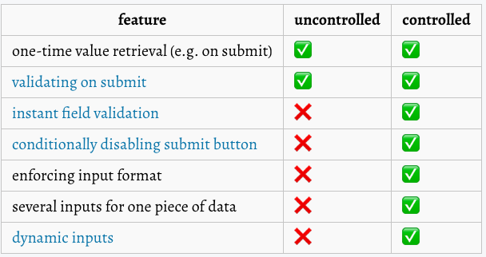

### 제어 컴포넌트

- React에 의해 값이 제어되는 입력 폼 엘리먼트
- input 필드에서 onChange 콜백을 통해 값이 제어된다.

### 비제어 컴포넌트

- DOM에서 값을 변경되도 DOM이 상태를 가지고 있다.
- 접근하려면 ref를 통해서 해당 엘리먼트를 접근해서 가져와야 한다.
- defaultValue를 사용할 수 있다.

    ```jsx
    render() {
      return (
        <form onSubmit={this.handleSubmit}>
          <label>
            Name:
            <input
              defaultValue="Bob"
              type="text"
              ref={this.input} />
          </label>
          <input type="submit" value="Submit" />
        </form>
      );
    }
    ```

- 비제이 컴포넌트의 대표적인 `<input type='file'/>` 에 대해서 알아보자

    ```jsx
    class FileInput extends React.Component {
      constructor(props) {
        super(props);
        this.handleSubmit = this.handleSubmit.bind(this);
        this.fileInput = React.createRef();
      }
      handleSubmit(event) {
        event.preventDefault();
        alert(
          `Selected file - ${this.fileInput.current.files[0].name}`
        );
      }

      render() {
        return (
          <form onSubmit={this.handleSubmit}>
            <label>
              Upload file:
              <input type="file" ref={this.fileInput} />
            </label>
            <br />
            <button type="submit">Submit</button>
          </form>
        );
      }
    }

    ReactDOM.render(
      <FileInput />,
      document.getElementById('root')
    );
    ```

[비제어/제어를 언제 써야 하나?(출처)]



### [웹 컴포넌트](https://developer.mozilla.org/ko/docs/Web/Web_Components)

- React 처럼 DOM에서도 커스텀 컴포넌트를 만들 수 있다.
- WebComponent는 재사용할 수 있는 컴포넌트(HTML)
- React는 데이터와 Dom을  동기화하는 선언적 라이브러리이다.
- React 또한 Web Component를 지원하기 때문에 React안에서도 사용 가능하다.

```jsx
class XSearch extends HTMLElement {
  connectedCallback() {
    const mountPoint = document.createElement('span');
    this.attachShadow({ mode: 'open' }).appendChild(mountPoint);

    const name = this.getAttribute('name');
    const url = 'https://www.google.com/search?q=' + encodeURIComponent(name);
    ReactDOM.render(<a href={url}>{name}</a>, mountPoint);
  }
}
customElements.define('x-search', XSearch);
```
