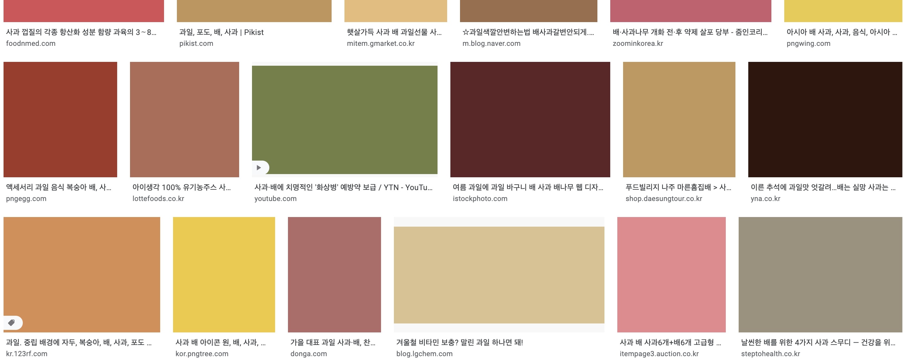

## ``
1. 정의
    - html 문서에 이미지를 넣기 위한 태그이다.

2. 속성
    - alt : 이미지에 대한 설명이며, 스크린 리더가 이 값을 읽는다.
    - title: 커서를 올릴때, 툴팁 텍스트에 대한 내용
    - src : 해당 이미지에 대한 위치 or URL로 불러오며 특징은 SOP 미적용
    - crossorigin : default는 anonymous로 SOP가 미적용된다.
    - decoding
        - sync : 다른 콘텐츠와 함께 표시하기 위해 이미지를 동기적으로 디코딩 합니다.
        - async : 다른 콘텐츠의 표시 지연을 피하기 위해 이미지를 비동기적으로 디코딩 합니다.
        - auto : 브라우저가 판단하여 최적을 판단한다.
    - loading
        - eager
            - 뷰포트 안에 위치하는지 여부에 상관하지 않고 이미지를 즉시 불러옴 
            - 페이지가 렌더링 되면서 해당 페이지에 있는 이미지를 전부 그려준다. 
            - 문제점은 불필요한 이미지를 요청하기 때문에 리소스 소비가 심하다.
        - lazy
            - 이미지 태그가 적당한 뷰포트로 들어와야지 이미지 소스를 요청한다.
            - 불필요하게 네트워크와 저장소 대역폭을 낭비시키지 않는다.
            - 구글 이미지 또한 동일하게 적용되있다.  
            
    - src : 이미지 소스의 url이며 픽셀 밀도는 1x 이미지로 취급한다.
    - srcset : 브라우저에게 제시할 이미지의 목록과 크기를 정의하고 작성법을 참고한다
        ```html
        
        ```
        - 브라우저 작동은 어떻게 할까?
            1. 기기 너비를 확인
            2. sizes 목록에서 참이 되는 값을 찾는다.
            3. 해당 값에 맞는 이미지를 불러온다.
    - vertical-align : 이미지 태그는 baseline 기준이어서 아래 공백이 생기는데 middle 변경하여 공백 삭제 가능
    - object-position : 이미지의 위치를 x, y 축으로 변경가
    - object-fit : 태그 내의 이미지의 크기를 조절 가능(중요)
   
## `<picture>`
1. 정의 : HTML5에 추가된 태그로 반응형 디자인때 많이 사용
2. 사용법 : picture 태그의 자식으로 0개 이상의 source 태그와 img태그를 넣어준다.(이유 : picture 태그 미지원에 따른 호환성)
3. 예시
    ```html
       <picture>
         <source
           media="(min-width: 650px)"
           srcset="https://images.unsplash.com/photo-1589965716319-4a041b58fa8a?ixlib=rb-1.2.1&ixid=eyJhcHBfaWQiOjEyMDd9&auto=format&fit=crop&w=1867&q=80"
         />
         <source
           media="(min-width: 465px)"
           srcset="https://images.unsplash.com/photo-1534235261404-7625cd79bdb9?ixlib=rb-1.2.1&ixid=eyJhcHBfaWQiOjEyMDd9&auto=format&fit=crop&w=1950&q=80"
         />
         
       </picture>
    ```
4. 정리 : 이미지 태그를 조금더 쉽게 사용할 수 있게 나온 태그인것 같다. 
