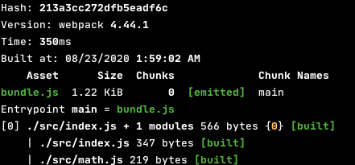

##[Tree Shaking](https://developer.mozilla.org/ko/docs/Glossary/Tree_shaking)
1. 정의
    - 사전적 의미 : 나무 흔들기(== 나무를 흔들어 불필요한 가지나 나뭇잎을 떨어뜨린다.)
    - 자바스크립트 의미 : 자바스크립트 실행환경에서 죽은 코드(사용되지 않는 코드) 제거
    - ES2015의 import / export와 관련이 있다.(모듈을 통해서 파일을 관리 / Common JS 안된다.)
    - Webpack or Rollup 같은 번들러를 통해 자동으로 tree shaking을 실시한다.(추가적인 설정 및 import를 잘 사용하면!!)
    
2. [번들링을 하는 이유?](https://exploringjs.com/es6/ch_modules.html#_benefit-dead-code-elimination-during-bundling)
    - 우리가 추가한 패기지들을 한꺼번에 불러올려면 하나의 파일로 만드는게 낫다 
        - HTTP/1에서는 파일을 요청하는 리소스가 크기 때문에 한 파일을 만들어서 요청하는게 좋다.
        - 하지만 HTTP/2가 나오면서 크게 상관이 없어진다...
    - 번들링을 한 파일을 압축하는게 더 효율적이다(따로 따로 압축하는것 보다 / 이유 : 통신하기 위해)
    - 번들링을 하면서 불필요한 공간(화이트 스페이스 등등)과 불필요한 모듈의 함수를 제거할 수 있다.(공간 절약)
        - ES2015는 모듈 시스템으로 하나의 tree로 변환시켜 쉽게 treeShaking을 할 수 있다.

3. [설정 및 방법](https://ui.toast.com/weekly-pick/ko_20180716/)
    - Babel이 CommonJS로 만들어주는 것을 막아주자
        ```js
        // .bablerc
          {
            "presets": [
              ["env", {
                "modules": false
              }]
            ]
          }
      
        // package.json
         {
           ...
           "babel": {
             "presets":["env", { "modules": false}]
           }
         } 
        ```
    - SideEffect 막아주자
        - 만약 사용하지 않는다고 모듈이라고 해도 다른곳에서 사용되서 삭제가 되면 문제가 생기기 때문이다.
        ```js
        // package.json
         {
           // sideEffect는 ['경로/파일명']을 통해서도 추가 가능
           "sideEffects": false,
           "scripts": {
            "build": "webpack --mode production" // production에서만 가
           },
           "babel": {
             "presets":["env", { "modules": false}]
           }
         } 
        ```
    - Import 구문 사용법
        ```js
        // math.js
        export function square(x) {
          return x * x;
        }
        
        export function cube(x) {
          return x * x * x;
        }
      
        export default {square, cube}
      
        // index.js
        // 필요한 함수만 꺼내서 써야지 번들링 될때 그 함수를 포함해서 만들어준다.
        import { cube } from './math.js';  // 번들링을 하게 되면 cube 함수만 포함
        import * as Math from './math.js'; // 번들링을 하게 되면 cube, squre 함수가 포한된다.     
        ```
    - 전/후 파일 크기 차
        - tree shaking 전
          
        - tree shaking 후 
           

## webpack 관련 기타사항
1. 번들링된 파일명에 대해서
    - vandors.[hash].js : React 관련 third-party 라이브러리
    - main.[hash].js : 우리가 작성한 코드
2. plugin 추가 방법 및 chunkhash 추가 방법   
    - webpack.config.js
        ```js
         const path = require('path');
         const HtmlWebpackPlugin = require('html-webpack-plugin');
         
         module.exports = {
           entry: './src/index.js',
           output: {
             filename: 'main.[chunkhash].js',
             path: path.resolve(__dirname, 'public')
           },
           mode: "production",
           plugins: [new HtmlWebpackPlugin() ]
         }

        ````
