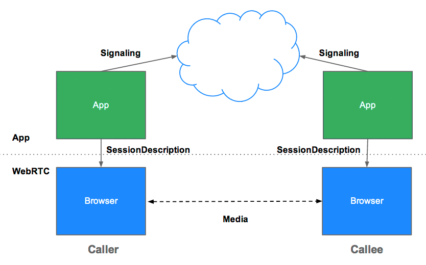

## getUserMedia()  : MediaStream
1. 미디어(마이크, 카메라)의 동기화된 스트림(마이크 트랙, 카메라 트랙)
2. MediaStream을 URL.createObjectURL()로 `<video> <audio>`의 소스로 사용가능
3. getUserMedia()의 인자로 비디오 관련 설정을 넣어 개발자가 원하는 스트림을 가질 수 잇다.
    - 화면 비율
    - 화면모드(앞 / 뒤)
    - 프레임 속도
    - 높이와 너비
    - 주의사항 - 사용자가 권한요청을 거부하게 된다면 에러 메세지를 반환한다.

## Signaling
1. 비디오 코덱 및 해상도에 대한 정보/ 네트워크에 대한 정보를 교환하는 작업
    - 시기 : 스트리밍하기 전 무조건 완료해야 
2. 시그널링을 통해 교환하는 정보
    - Session Control message :  통신의 시작과 종료 그리고 에러 내용 리포트
    - Network 설정 : 나의 아이피 정보 및 포트
    - 미디어 설정 : 브라우저간의 사용가능한 비디오 코덱 및 해상도 정보

## Sinaling Flow(jun : 주최)

### 네트워크 정보 교환

1. RTCPeerConnection을 통해 onicecandidate 핸들러 생성
2. 핸들러는 네트워크 candidates(비디오, 오디오 트랙 전송)가 가능해지면 실행됩니다.(Call 버튼 클릭)

    ```jsx
    pc = new RTCPeerConnection(configuration);

    // send any ice candidates to the other peer
    pc.onicecandidate = function (evt) {
        signalingChannel.send(JSON.stringify({ "candidate": evt.candidate }));
    };

    // once remote stream arrives, show it in the remote video element
    pc.onaddstream = function (evt) {
            remoteView.src = URL.createObjectURL(evt.stream);
    };
    ```

3. Jun는 candidata data를 시그널링 서버(WebSocket, fetch)를 통해 DuDu에게 전달
4. DuDu는 받은 candidate의 정보를 addIceCandidate를 통해 해당 peer에 추가
    - setRemoteDescription이 설정 시작
    - signalingstatechange 이벤트가 발생하고 offer 확인
    - setRemoteDescription의 마무리되면 addIceCandidate를 통해 cadidate를 추가
        - 넘어오는 트랙에 따라 오디오 하나, 비디오 하나
    - createAnswer를 통해 시그널링 서버를 통해 sdp 정보를 전달한다.
    - 전달 후 setLocalDescription을 통해 DuDu의 dsp를 설정하고 addIceCandidate를 통해 candidate를 추가한다.

### 미디어 정보 교환

1. Jun는 RTCPeerConnection를 통해 createOffer(callback)를 호출한다
    - 콜백안에는 Jun의 sdp(미디어 설정)을 setLocalDescription에 설정
        - icegatheringstatechange : gathering
    - 시그널링 서버를 통해 생성된 offer를 DuDu에게 전달
2. DuDu는 받은 Jun의 sdp정보를 setRemoteDescription에 설정
3. DuDu는 createAnswer()에 Jun으로 부터 전달받은 RemoteDesc를 실행하여 Local Session 생성
4. DuDu는 본인의 sdp를 setLocalDesciption에 설정하고 answer를 전달
5. Jun은 받은 answer로 받은 sdp를 setRemoteDescription을 설정
    - iceconnectionstatechange : checking / connectionstatechange : connection
    - iceconnectionstatechange : connected / signalingstatechange : stable
    - setRemoteDescription Success
    - addIceCandidate를 통해 candidate 추가
    - icegatheringstatechange : complete
    - iceconnectionstatechange : connected ⇒ complete로 변경후 지속적인 데이터 통신

### 네트워크/미디어 정보교환은 동시에 완료된다
### 그 이후 Peer간 직접 주고 받게 된다

## ICE Framework

1. ICE
    - Peer들과 연결하기 위한 최적의 경로를 찾으려 합니다.(SDP를 결정한 후!)
    - 동시에 가능한 모든 것을 시도하며 동작하는 가장 효율적인 선택을 골라냅니다.
    - 대기시간이 적은 UDP 찾는 과정 때문에 스트리밍이 연결 초반에는 영상 품질이 낮을 수 있다
    - ICE는 첫번째로 다음과 같이 디바이스 운영체제로와 네트워크 카드로부터 획득한 호스트 주소를 사용하여 연결을 생성하려 합니다. 만약 실패한다면 (디바이스가 NAT 뒤에 있을 것입니다.) ICE는 STUN 서버를 이용하여 외부 주소를 획득하고 그것이 실패한다면 TURN 중계 서버를 통해 트래픽을 라우팅합니다.
2. STUN : NAT 뒤에 있는 피어들이 연결 가능하도록 자신들의 공용주소와 포트를 찾는다. 
3. TURN : NAT와 방화벽으로 인해 직접연결이 안되면 TURN 서버를 사용
    - 릴레이 하는 STURN서버 
    - 모든 정보를 중계하기 때문에 최악의 경우만 사용


