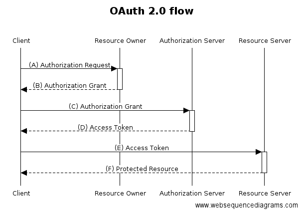

## 0. 이글을 작성하는 이유?

- Session Cookie Oauth에 대해서 설명하고 싶어서...


```jsx
HTTP란?

개요 : 클라이언트-서버 프로토콜
특징 : HTTP는 상태를 저장하지 않는다(즉, 한번 통신하고 끝)
```

### 1. Session

- 사전적 의미 :  정보 교환을 하는 둘 이상의 통신 장치의 송수신 연결 상태
- 개요
  1. 서버에서 관리하는 어떠한 상태를 세션이라고 한다.(로그인 정보 등)
  2. 모든 Request별로 상태를 유지하는 것은 서버자원 낭비
  3. HTTP 특성상 상태를 저장하지 않기때문에, 같은 브라우저가 Request를 하여도 같은 세션인줄 모른다

### 2. Cookie

- 사전적 의미 : 사이트를 방문하면, 서버로 부터 설치되는 기록 정보 파일
- 개요 :
  1. 서버가 클라이언트를 기억하기 위한 방법의 일종
  2. 해당 세션 / 브라우저 종료시, 쿠키 만료
- 동작방식
  1. 브라우저가 특정 페이지 요청(to Server)
  2. 서버에서 Session 생성
  3. 해당 Session의 정보를 Response Header에 쿠키로 추가(Set-Cookie)
  4. 응답을 받은 Cookie 정보를 브라우저(Storage - Cookie)에 저장
  5. 다음 요청부터는 서버로 요청시, 해당 쿠키를 동반해서 보낸다

### 3. OAuth

- 사전적 의미 : 비빌번호를 제공하지 않고 다른 사이트 상의 자신들의 정보에 대해 웹사이트나 애플리케이션의 접근 권한을 부여할 수 있는 공통적인 수단
- 개요
  1. OAuth는 인증 프로토콜이 아닌, 인가 프로토콜이다.
  2. Google / Naver Login같은 소셜 로그인은 OAuth로 구성되잇다.
- 역할 및 동작방식

  

  **1. 역할**

  - Client(브라우저)
  - Resource Owner(사용자 ID/PW를 알고 있는 사람 : 사용자)
  - Authorization Server(Facebook Oauth 서버)
  - Resource Server(FaceBook의 내정보를 가지고 있는 곳)

  **2. 동작방식**

  1. FaceBook 소셜로그인 버튼 클릭
  2. Facebook 로그인 - (A), (B)
  3.  해당사이트의 접근을 허용 할 것인가? - (C)
  4. 로그인 목적으로 사용할 수 있는 Access Token을 발급. - (D)
  5. Access Token을 이용하여 서비스를 사용하는 과정 - (E), (F)

  ### 4. Token

  - 사전적 의미 : 최소 단위의 정보를 가진 물체
  - 종류
    1. Access Token : 특정 정보에 접근할 수 있는 권한을 가진 토큰
    2. Refesh Token : Access 토큰 만료로 사용할 수 없을때, Refresh 토큰을 이용하여 새롭게 인증하지 않아도 Access 토큰을 새롭게 받을 수 있다.

  ### 5. 출처

  [https://ko.wikipedia.org/wiki/](https://ko.wikipedia.org/wiki/)

  [https://interconnection.tistory.com/76](https://interconnection.tistory.com/76)
