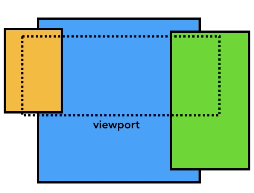

### 0. 글을 작성하는 이유
- 너무나도 좋은 자료인데, 정리를 해서 나의 것으로 만들고 싶어서
- 웹 브라우저의 동작 원리에 대해서 자세히 알고 싶어서
- 웹 브라우저의 여러가지 쓰레드에 대해서 알고싶어서

---

## Part 1 (브라우저의 개별 프로세스와 스레드)

### 1. 사전 지식 : Process, Thread, IPC

- Process(프로세스)
    - 보조기억장치(HDD)에 위치한 프로그램이 메모리에 올라온 상태
    - OS는 프로세스에게 메모리를 할당하여 해당 프로세스의 정보를 고유한 메모리 공간(PCB)에 저장할 수 있게 한다.
    - 자원소유의 단위(메모리가 할당되었다)
- Thread(쓰레드)
    - 프로세스 내부에 있으며 프로세스를 실행하는 주제
    - Dispatching의 단위(CPU에게 계산/연산 처리를 요청하는 단위)
- IPC(Inter Process Comunication)
    - 프로세스는 다른 프로세스를 돌려서 별도의 작업을 수행하도록 OS에 요청 할 수 있다.

      (OS는 새로운 프로세스에게 별도의 메모릴 공간을 할당한다)

    - 두 프로세스간 통신이 필요하다면, IPC를 이용한다(데이터 교환)

### 2. 웹 브라우저에는 어떤 프로세스가 있나?

- 메인 프로세스와 여러개의 작은 프로세스가 통신하면서(IPC) 작동
- 프로세스의 정의와 역할
    1. 브라우저(Main) - 브라우저의 전체적인 제어 및 탭 밖에 있는 모든 프로세스를 담당
        - 브라우저의 버튼이나 입력창을 그리는 **UI 쓰레드**
        - 데이터를 수신하는 **네트워크 쓰레드**
        - 파일 같은것들을 접근하기 위한 **스토리지 쓰레드**
    2. 렌더링 - 웹 사이트가 디스플레이 될때 사용되며, 각 탭 별로 프로세스가 존재
        - 각 탭로 별도의 프로세스로 관리되기 때문에 하나가 멈춰도 다른 탭은 정상 작동
    3. 플러그인 - 리엑트 개발자 도구 같은 플러그인 관리
    4. GPU - 다른 프로세스와 분리된 GPU 작업을 제어
        - 동일한 표면(창)에 표시하기 때문에 별도로 분리

---

## Part 2(멀티 프로세스 구조와 탐색 순서)

### 1. jooonho.com을 치면 어떻게 작동이 될까?

1. 입력 처리
    - 사용자가 주소창에 입력하기 시작하면 UI 쓰레드가 검색어인가? URL인가? 판단

      

2. 탐색 시작
    - 엔터를 치면, UI 쓰레드가 컨텐츠를 내려받기 위해 네트워크 쓰레드에게 요청

      

3. 응답 읽기
    - 네트워크 쓰레드가 응답 파일을 체크해서 해당하는 프로세스에게 데이터 이관
        - HTML ⇒ 해당 탭의 렌더링 프로세스에게 이관
        - zip 또는 다른 형식의 파일 ⇒ 다운로드 매니저에게 이관
    - 넘기기전, CORB 체크(악성 사이트 여부)로 경고창 노출

      

4. 렌더링 프로세스 찾기
    - 네트워크 쓰레드를 통해 UI 쓰레드에게 데이터를 준비되었다고 통보
    - UI쓰레드는 해당 페이지를 그릴 렌더링 프로세스를 찾는다

      

5. 탐색 수행

    - 브라우저 프로세스는 IPC를 통해 렌더링 프로세스에게 해당 데이터를 전송
    - 데이터 스트림을 전달, 렌더링 프로세스가 HTML 데이터를 계속 받을 수 있게 진행
    - 렌더링에서 커밋이 확인되면, 브라우저 프로세스는 탐색을 완료하고 문서 로딩 시작

  

6. 초기 로딩 완료

    - 탐색이 커밋되고, 렌더링 프로세스가 리소스 로딩과 페이지 렌더를 지속
    - 렌더링 프로세스가 렌더링을 끝내면, 브라우저 프로세스에게 IPC를 반환
    - UI쓰레드가 탭의 로딩 스피너를 정지

  

### 2. 다른 사이트 탐색

- 위와 같은 동일한 방법으로 사이트를 탐색, 그 전에 beforeunload 이벤트 호출
- 화면 내에서 링크를 클릭하거나, location.href를 호출
    - 렌더링 프로세스가 beforeunload 핸들러 체크
    - 렌더링 프로세스가 탐색 요청을 브라우저 프로세스에 요청을 전달
- 렌더링 프로세스가 unload 이벤트가 처리가 되면서 새로운 렌더링 프로세스를 호출

  

### 3. Service Worker의 경우

- 서비스 워크가 등록되면, 재탐색할때 네크워크 쓰레드가 URL을 서비스워커에서 탐색
- 있다면, UI 쓰레드가 해당 Service Worker 코드를 실행하기 위해 렌더링 프로세스를 탐색
- Service Worker는 캐시에서 데이터를 로드하며, 네트워크 요청을 초기화

  

---

## Part 3(렌더링 프로세스의 내부 동작)

### 1. 렌더링 프로세스의 역할 및 쓰레드

- 렌더링 프로세스는 브라우저 탭 안에서 일어나는 모든 일들을 담당한다.
- 주요 역할
    - HTML, CSS, JS로 사용자가 인터렉션 할 웹 페이로 만드는 것
- 메인 쓰레드(대부분의 코드를 처리), 워커, 컴포지트, 레스터 쓰레드가 존재한다.

  

### 2. 파싱

1. DOM 생성(메인 쓰레드)
    -  탐색이 커밋되고, 데이터를 받기 시작할때, 메인쓰레드는 HTML을 파싱(DOM)
2. 추가 리소스 로딩(메인 쓰레드)
    - 추가 리소스(이미지, CSS, JS 파일)는 네트워크 혹은 캐시를 통해 로드
    - DOM을 생성하면서 link, img 태그를 확인하면, 네트워크 쓰레드에게 요청
    - 사전로드스캐너 : 파싱 중 생성된 토큰들을 통해 미리 처리하는 것

      

3. 자바스크립트를 로딩하면, 왜? 파싱이 멈출까?

    - document.write()와 같은 방법으로 DOM의 구조를 바꿀 수 있기 때문
    - async와 defer 속성을 이용하여 비동기적으로 로드하고 실행 할 수 있음

### 3. 스타일 계산(메인 쓰레드)

- css를 파싱해서 각 DOM노드에 대한 계산된 스타일을 결정
- CSS selector를 기반하여 각 요소들에 어떤 스타일이 적용될지 파악

  

### 4. 레이아웃(메인 쓰레드)

- DOM과 계산된 스타일을 따라가며 xy좌표 및 bounding box 크기로 레이아웃 트리 생성
- 레이아웃 트리에는 display: none 속성은 포함되지 않으나, before,after는 포함

  

### 5. 페인트(메인 쓰레드)

- 레이아웃 트리를 통해 어떤 순서를 그릴지 판단(예, z-index 따라 보여지는게 다름)
- 메인쓰레드는 레이아웃 트리를 따라가면서 페인트 기록을 생성

  

1. 렌더링 파이프라인에 대한 이해

    - 각 단계에서 그 전 실행 단계를 결과물을 사용한다 (스타일 → 레이아웃 → 페인트)

2. 애니메이션 프레임에 대한 이해

    - 브라우저는 매끄러운 동작을 보여주기 위해, 매초 60번 업데이트를 해준다.
    - 만약, 자바스크립트로 메인쓰레드가 블로킹 된다면, 화면이 멈춘(인터렉션 없다)
    - requestAnimationFrame을 이용하여, 매 프레임마다 실행 시킬 수 있게 한다.

      

      

### 6. 컴포지팅(컴포지트 쓰레드)

1. 페이지를 그리는 방법
    - 레스터라이징: 레이아웃 트리와 페인트 순서를 스크린의 픽셀로 바꾸는 것
    - 처음에는 사용자가 보여지는 부분(viewport)를 기준으로 레스터하여 보여준다.
    - 스크롤 하게되면, 레스터된 프레임이 움직이고, 빈 부분을 레스터링 하여 보여준다.

2. 컴포지팅이란?

    - 한 페이지를 여러 레이어로 나눠, 레스터하여 페이지를 합성하는 기술
    - 스크롤 하게 되면, 레이어들이 이미 레스터 되었기 때문에, 새로운 프레임을 합성

      

3. 레이어 대한 고찰

    - 메인 쓰레드는 레이아웃 트리를 순회하여 레이어 트리를 생성

      (어떤 요소들이 어떤 레이어에 있는지 확인하기 위해)

    - 지나친 수의 레이어를 만들어 컴포지팅 하는 것은 렌더링 성능을 떨어뜨림

  

4. 메인 스레드를 사용하지 않고 레스터와 컴포지트 하기

    - 레이어 트리가 생성, 페인트 순서가 결정, 메인 쓰레드는 컴포지트 쓰레드에게 커밋
    - 컴포지트는 레이어들을 여러 타일로 쪼개고 각 타일을 다수의 레스터 쓰레드에게 전송
    - 레스터 스레드들은 각 타일을 레스터라이즈 하고 그것들을  GPU메모리에 저장
    - 타일들이 레스터되면, 컴포지트 쓰레드는 컴포지트 프레임을 생성
    - 컴포지트 프레임은 IPC를 통해 브라우저 프로세스로 넘김
    - 컴포지트 프레임들은 GPU로 보내져 화면을 보여준다
    - 스크롤 하게 되면,  컴포지트 쓰레드는 GPU에게 보내질 컴포지트 프레임을 생성한다.

  

---

## Part4(이벤트와 컴포지트 쓰레드의 상호작용)

### 1. 브라우저 관점에서 입력 이벤트

- 화면에서 이벤트가 발생하면, 브라우저 프로세스가 해당 이벤트의 좌표를 수신
- 해당 좌표를 렌더링 프로세스로 전달
- 렌더링 프로세스는 전달받은 좌표로 해당 이벤트 대상를 찾아 리스너를 실행하여 처리

  

### 2. Non-Fast Scrollable Region

- 컴포지트 쓰레드는 이벤트 핸들러가 첨부된 영역을 "Non-Fast Scrollable Region"
- 해당 영역에서 이벤트가 발생하면, 컴포지트 쓰레드가 메인쓰레드로 정보를 전달
- 그 외에서 이벤트가 발생하면, 컴포지트는 새로운 컴포지트 프레임을 만드는 일만 진행

  

### 3. 이벤트 대상 찾기(Main 쓰레드)

- 렌더링 프로세스의 페인트 기록을 확인하여(히트테스트) 이벤트가 발생한 대상을 탐색

  

---

## 관련출처

- [https://developers.google.com/web/updates/2018/09/inside-browser-part1](https://developers.google.com/web/updates/2018/09/inside-browser-part1?hl=ko)
- [https://developers.google.com/web/updates/2018/09/inside-browser-part2](https://developers.google.com/web/updates/2018/09/inside-browser-part2)
- [https://developers.google.com/web/updates/2018/09/inside-browser-part3](https://developers.google.com/web/updates/2018/09/inside-browser-part3)
- [https://developers.google.com/web/updates/2018/09/inside-browser-part4](https://developers.google.com/web/updates/2018/09/inside-browser-part4)
