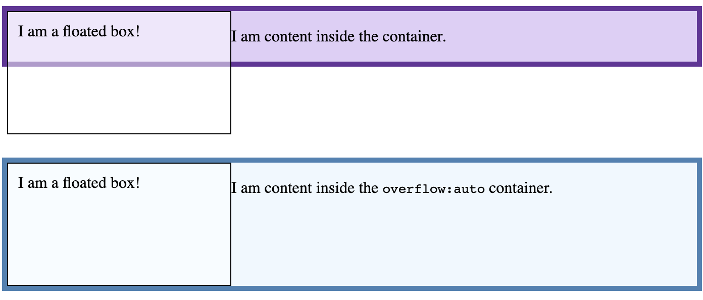
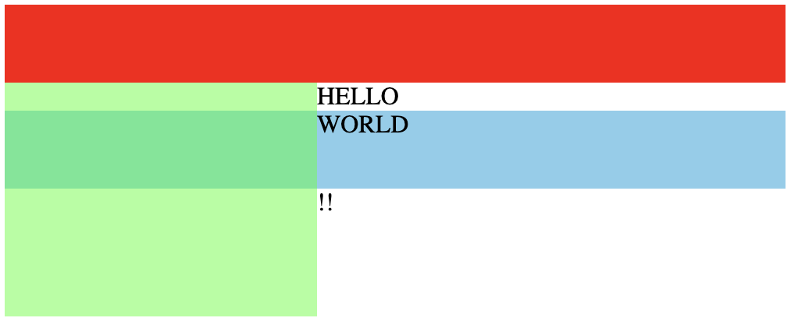

### 0. 작성이유
- 코드스피치 CSS 강의 내용 정리
- 디자인 구현을 더 빠르게 하기 위한 개념 정리..
- inline guard에 대해서 신기해서 공유하고 싶어서..

### 1. Normal Flow

- 정의: HTML 요소(블록, 인라인 요소)의 배치방법(default)
    1. Block Level Element(블록요소)
        - width : 부모 요소의 너비 100%
        - heigth :  Content의 최대 높이
        - 블록요소는 마지막 요소 아래 라인에 위치
        - Margin에 의해서 구분되며, 더 큰 Margin 쪽으로 margin collapsing 된다.
    2. Inline Element(인라인 요소)
        - 콘텐츠의 크기(width/height)를 따르나, 별도로 설정할 수 없음.
        - 인라인 요소와 같은 라인에 차례로 위치
        - 해당 라인의 충분한 공간이 없다면, overflow 되는 텍스트 또는 요소는 새로운 줄에 위치
        - margin은 쓰기모드의 방향으로만 적용

### 2. BFC(Block formatting contexts)

- 정의 : 블록 박스의 레이아웃이 발생하는 지점과 플로팅 요소의 상호작용 범위를 결정하는 범위
- 나만의 해석
    - BFC는 레이아웃 안의 작은 레이아웃이 생긴다!
    - 특정 css속성을 가지면, 블록 레이아웃의 특성을 가진다. (BFC 생성)
    - BFC 내부의 모든 요소는 블록 안에 속한다.
- BFC 생성 조건
    - 문서의 루트 요소(`<html>`).
    - 플로팅 요소(`float이 none`이 아님).
    - 절대 위치를 지정한 요소(`position`이 `absolute` 또는 `fixed`).
    - 인라인 블록(`display`가 `inline-block`).
    - `overflow`가 `visible`이 아닌 블록 요소.
    - `display`가`flow-root`.
    - table, flex, grid ...
- BFC 예제

    ```jsx
    <section>
      <div class="box">
        <div class="float">I am a floated box!</div>
        <p>I am content inside the container.</p>
      </div>
    </section>

    <section>
      <div class="box" style="overflow:auto">
        <div class="float">I am a floated box!</div>
        <p>I am content inside the <code>overflow:auto</code> container.</p>
      </div>
    </section>
    ```
  

### 3. IFC(Inline formatting contexts)

- 정의 : IFC는 다른 서식 컨텍스트 내에 존재하면, 인라인 요소의 레이아웃 발생
- IFC 생성 조건
    - `<strong>`, `<a>`, `<span>` 같은 엘리먼트에 의해서 생성

### 4. Inline Guard

- float 속성은 인라인 요소에 대해 영역을 인식함(블록 요소는 인식 안함)

    ```jsx
    <div style="width: 500px">
        <div style="height: 50px;background: red"></div>
        <div style="width: 200px;height: 150px;float:left;background: rgba(0,255,0,0.5)"></div>
        HELLO
        <div style="height: 50px;background: skyblue">WORLD</div>
        !!
    </div>
    ```
    


## 관련출처
- [https://developer.mozilla.org/ko/docs/Web/CSS/CSS_Flow_Layout/Intro_to_formatting_contexts](https://developer.mozilla.org/ko/docs/Web/CSS/CSS_Flow_Layout/Intro_to_formatting_contexts)
